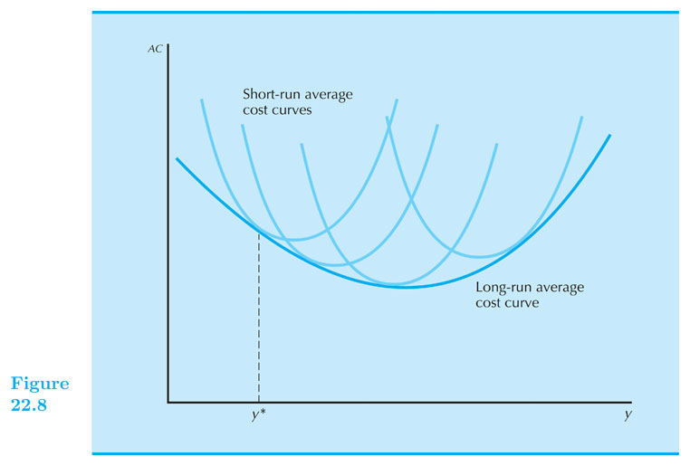

## Cost Curves

#### Intermediate Microeconomics (Econ 100A)

#### Kristian López Vargas

#### UCSC - Spring 2017

------

## Cost Curves - Average Costs

* Total cost: $ c(q) = c_v(q) + F $ 

* Average Cost: $ AC(q) = \\frac{c(q)}{q} = \\frac{c_v(q)}{q} + \\frac{F}{q} $

* That is: $ AC(q) = AVC(q) + AFC(q) $

* Notice FC does not depend on $ q $, but AFC does depend on $ q $.
 
* Can AFC increase in $ q $

------

## Average Costs

-----

## Marginal Cost

* Marginal cost is the change in cost due to change in output 

* $ c’(q) = \\frac{ ∂c(q) }{ ∂q } = \\frac{ ∂c_v(q) }{ ∂q }  $

------

## The geometry of total cost, AC, AVC and MC

* MC: is the slope of a tangent line of c(q) at q level. 
 
* AC: is the slope of the ray from the origin to c(q) at q level.

* See document camera side
 
* [https://www.econgraphs.org/graphs/micro/producer_theory/cost_curves](https://www.econgraphs.org/graphs/micro/producer_theory/cost_curves)

------

## Some relations of Cost Curves

* Marginal cost equals *AVC* at zero units of output

    * Because AVC starts at the origin. 

* MC: crosses at minimum points of *AC* and *AVC*.
    
    * MC < AC when AC is decreasing and MC > AC when AC is increasing. 

------

## Cost Curves

<iframe src="https://www.desmos.com/calculator/dvxems10cv?embed"
width="600px" height="600px"
style="border: 1px solid #ccc" frameborder=0></iframe>

<!--  -->

----------------------------------

## Cost Curves - Example:

* $ c(q) = 1 + q^2 $

* $ c_v(q) = ? $ 

* $ FC(q) = ? $

* $ AVC(q) = ? $

* $ AFC(q) = ? $

* $ AC(q) = ? $

* $ MC(q) = ? $

------

## Cost Curves - Example:

<iframe src="https://www.desmos.com/calculator/bbxooxcg19?embed"
width="600px" height="600px" style="border: 1px solid #ccc"
frameborder=0></iframe>

<!--  -->

------

## Cost Curves - do-at-home examples:

* $ c(q) = 10 - 0.5(q-2)^2 + (q-2)^3 $
 
* Try with all kinds of functions...

------

## Cost minimization in two plants

* Possibly two technologies, therefore two cost functions $ c_1(q_1) \\text{ and } c_2(q_2) $
  
* Graphical approach

    * Use a production-requirement "box"

* Mathematical approach

    * $ \\text{minimize} (C = c_1(q_1) + c_2(q_2)) $ subject to: $ q_1 + q_2 = q $
    
    * replace $ q_2 $ by $ q-q_1 $ and solve $ dC/dq_1 = 0$
     
    * Solution: $ q_1 \\text{ and } q_2 $ such that $ MC_1(q_1) = MC_2(q_2) $ 

------

## Long-run and short-run cost function - Example.

* $ q = 50 L^{0.5} K^{0.5} $

* Find long run cost function:

    * Total Cost (TC): $ c(w,r,q) = (q/25)(wr)^{0.5} $ 
     
    * $ AC(w,r,q) = (1/25)(wr)^{0.5} $
    
    * $ MC(w,r,q) = (1/25)(wr)^{0.5} $

------

## Long-run and short-run cost function - Example.

* $ q = 50 L^{0.5} K^{0.5} $

* Find short-run cost function ($ K = \\bar{K} $):

    * $ L^{SR} = \\frac{ q^2 }{ 50^2 \\bar{K} } $

    * $ c^{SR}(w,r,q) = w \\frac{ q^2 }{ 50^2 \\bar{K} } + r \\bar{K} $ 
     
    * $ {AC}^{SR}(w,r,q) = w \\frac{ q }{ 50^2 \\bar{K} } + r \\frac { \\bar{K} }{ q } $
    
    * $ {MC}^{SR}(w,r,q) = 2 w \\frac{ q }{ 50^2 \\bar{K} }  $

------

If for example w = 25 and r = 100:

    

------

## Short-run AC (SAC) and long-run AC (SAC) 

* Cost curves coincide if fixed level of capital is also LR solution.

<iframe src="https://www.desmos.com/calculator/eahxorwljj?embed"
width="600px" height="600px"
style="border: 1px solid #ccc" frameborder=0></iframe>

<!--      -->

------

## Short-run AC (SAC) and long-run AC (SAC) 

* More generally: LR cost curves envelope from below the SR ones.
 
    

-----

## EconGraphs - general Cobb-Douglas

<iframe 

src="https://www.econgraphs.org/graphs/micro/producer_theory/total_and_average_costs?embed=true&textbook=varian" 

style="border:0px #FFFFFF none;" name="myiFrame" scrolling="auto" frameborder="0" marginheight="0px" marginwidth="0px" height="600px" width="850px"

></iframe>

    
<!--

-----

-->

<!--

// This piece of code below creates the reveal presentation and pushes to GitHub and then deploys to GitHub pages. Modify the commit message and paste it into terminal.

cd docs && \
pandoc  \
-t revealjs -V revealjs-url=reveal.js \
--css=reveal.js/css/theme/simple.css \
-H reveal.js/js/revealMathJax.js \
-s S10_CostCurves_Ch22.md -o S10_CostCurves_Ch22.html && \
cd .. && \
git add docs/* && \
git commit -am " add content to S10_CostCurves_Ch22.md " && \
git push origin master && \
mkdocs gh-deploy 

-->