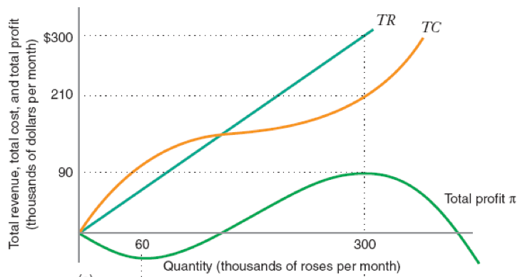
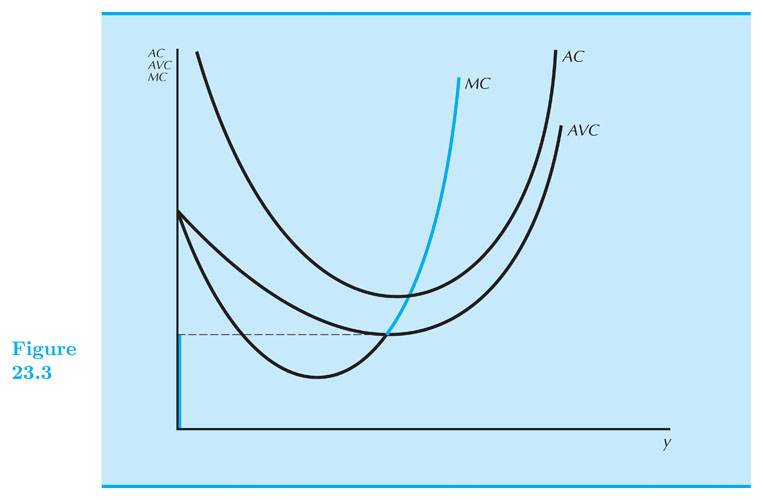
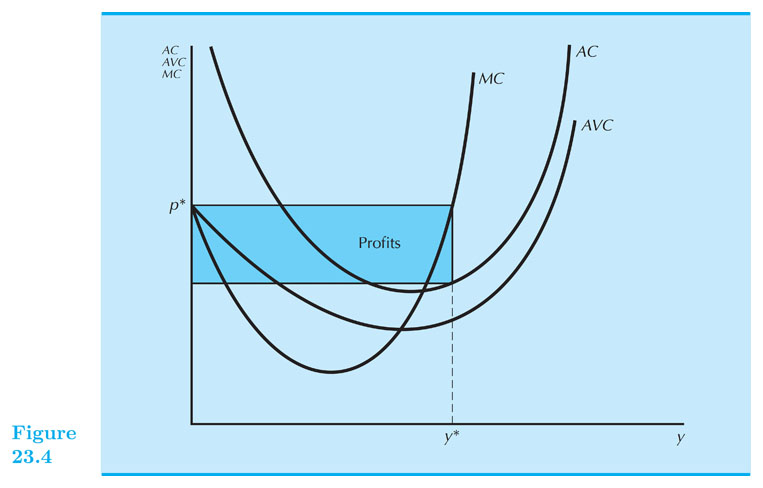
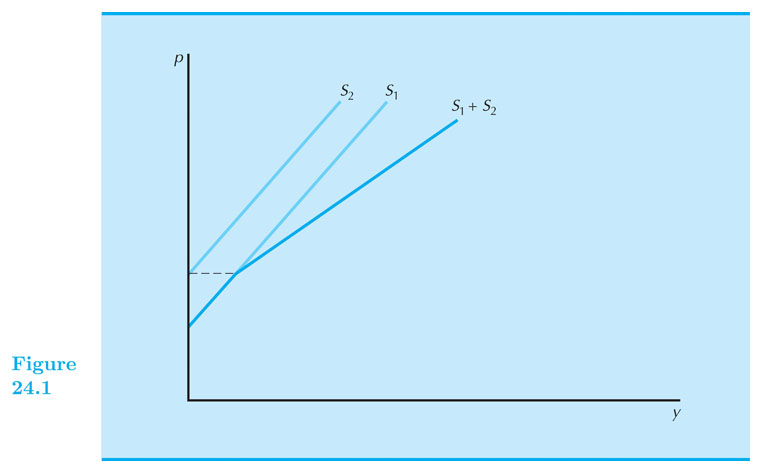

## Firm Supply and Industry Supply

#### Intermediate Microeconomics (Econ 100A)

#### Kristian López Vargas

#### UCSC - Spring 2017

------

## Recap on concepts and notation

Remember that we can write marginal cost in three different ways:

$ \\frac{∂ c(q) }{ ∂q} = c'(q) = MC(q) $  where $ c(y) $ is the cost function. 

Remember that revenue or "sales" are given by:

$ R(q) = p \\times q $

------

## Firm's constraints:  

* Technological constraints: what can be produced, how and from what inputs
    
    * The shape of the cost function if determined by production function and prices of inputs.

* Market constraints: how will consumers and other firms react to a given firm’s choice?
    
    * If I charge high price, I cannot sell many units.
     

------

## Perfect competition
   
Key feature of _perfect competition:_ agents take **market price as given**, outside of any particular firm’s
control.

This happen, typically, when many small agents operate in either side of the market.

If the firm is a price-taker at price level $ p^\* $ (e.g. the firm is one of many many producers) and tries to sell for a higher price, then it will sell zero units. 

If the firm charges exactly $ p^\* $, it can produce/sell pretty much as much as it wants. BUT What is the right quantity??  

------

## Total Revenue, Total Cost, and Profit

    

------

## Supply function of a competitive firm

We assume the firm wants to maximize profits $ \\pi(q) =  p \\times q − c(q) $

If $ \\pi(q) $ is smooth and has a global maximum, the optimal $ q $ is found by setting:

$$ \frac{∂ \pi(q) }{ ∂q} = 0 $$

As before, we call this the _first-order condition_ (FOC).

------

## Supply function of a competitive firm

The _first-order condition_ (FOC) implies:

$$
\begin{aligned}
\frac{∂ \pi(q) }{ ∂q} &= 0 \\\\
           MR - MC(q) &= 0 \\\\
            p - MC(q) &= 0 \\\\
            p   &= MC(q) \\\\
\end{aligned}
$$

The firm's MC curve determines the firm's supply function.

------

## Supply function of a competitive firm

However, the first order condition is not sufficient: sometimes it identifies a local minimum.

The derivative of profit wrt q is zero also at the bottom of a "valley".

While a local maximum (what we want) is found at the peak of the "hill".

How do we distinguish bottom of the valley from top of the hill?

See graph.

------

## Supply function of a competitive firm

In the top of the hill slope goes from positive to negative, decreases.

Second-order condition: $ \\pi''(q) = -c''(q) \\leq 0 ~ $ or $ ~ c''(q) \\geq 0 $

$$ \frac{∂ MC(q) }{ ∂q} \geq  0 $$

The supply function is not the whole MC(q), but only the segment that is upward-sloping.
  
Still, not the end of the story...  
  
----------------------

## When does the firm indeed operate? 

Compare profit from operation (q*>0) Vs. shutting down (q=0)
  
That is: $ p q  − c_v(q) − F ~ $ Vs. $ −F $

Operate if:  $ ~ p q  − c_v(q) − F  \\geq (−F) $

That is, if: $ p q  − c_v(q) \\geq 0 $

That is, if: $ p \\geq \\frac{c_v(q)}{q} = AVC(q) $

**Operate when price covers average variable cost (AVC)**

------

## Supply curve for the firm -- Finally! 

Supply curve is the upward-sloping part of MC curve that also lies above the AVC curve. 

    
Notice $ q^\* = 0 $ if $ MC < minAVC $.     
    
-----

## Identifying profits graphically
    

    
-----

## Inverse Supply curve

The _inverse supply curve_ is the same equation of the supply curve except we have solved for p:

Mathematically: 

$ p = c’(q) $ 

if $ c''(q) >0 $ and $ c'(q)>AVC $    

------

## Supply curve - Example - Steps

Suppose $ c(q) = q^2 +1 $

1. Calculate MC: MC = 2 q 
 
2. Equate MC = P: $ p = 2 q $. This gives the (inverse) supply curve.

3. Make sure $ MC \\geq AVC $: In this example, for any value of $ q>0 $ we have that MC > AVC, since: $ 2 q \\geq q $

4. _Supply_ is $ q = p/2 $ and _inverse supply_ is $ p = 2q $ 
    
------
    
## Short-run industry supply

The supply curve in the "short run of the industry" is the sum of the supplies of all participating firms.
 
$ S(p) = \\sum_1^n q^s_i(p) $

------

    
------

<!--

## Long-run supply — use long-run \textit{M}C. In long run, price must be greater than \textit{AC}

## Special case — constant average cost (\textit{CRS}): flat supply curve

  * see Figure 21.10

Ch 24

  * sum of the \textit{MC} curves

  * equilibrium in short run
look for point where $ D(p)=S(p) $
can then measure profits of firms
see Figure 22.2

## Long-run industry supply

  * change to long-run technology

  * entry and exit by firms
look at curves with different number of firm
find lowest curve consistent with nonnegative profit
see Figure 22.3.

## Long-run supply curve

  * exact — see Figure 22.4.

  * approximate — flat at $ p = minimum AC $

  * like replication argument

## Taxation in long and short runs

  * see Figure 22.6
  
  * in industry with entry and exit

  * part of tax is borne by each side

  * long run — all borne by consumers

## Meaning of zero profits

  * pure economic profit means anyone can get it

  * a mature industry may show accounting profits, but economic profits are probably zero

## Economic rent

  * what if some factors are scarce in the long run?
licenses — liquor, taxicab
raw materials, land, etc.

  * fixed from viewpoint of industry, variable from viewpoint of firm

  * in this case, industry can only support a certain number of firms

  * whatever factor is preventing entry earns rents
always the possibility of entry that drives profits to zero
if profits are being made, firms enter industry by
	a.) bringing in new resources
b.) bidding up prices of existing resources

  * see Figure 22.7

  * discount flow of rents to get asset value

  * politics of rent
rents are a pure surplus payment
but people compete for those rents
taxicab licenses — current holders want very much to prevent entry
subsidies and rents — incidence of subsidy falls on the rents
	a.) tobacco subsidies
	b.) farm policy in general
  
  * rent seeking

## Energy policy

  * two-tiered oil pricing

  * price controls

  * entitlement program

-->

<!--

// This piece of code below creates the reveal presentation and pushes to GitHub and then deploys to GitHub pages. Modify the commit message and paste it into terminal.

cd docs && \
pandoc  \
-t revealjs -V revealjs-url=reveal.js \
--css=reveal.js/css/theme/simple.css \
-H reveal.js/js/revealMathJax.js \
-s S11_FirmSupply_Ch23.md -o S11_FirmSupply_Ch23.html && \
cd ..

cd docs && \
pandoc  \
-t revealjs -V revealjs-url=reveal.js \
--css=reveal.js/css/theme/simple.css \
-H reveal.js/js/revealMathJax.js \
-s S11_FirmSupply_Ch23.md -o S11_FirmSupply_Ch23.html && \
cd .. && \
git add docs/* && \
git commit -am " add content to S11_FirmSupply_Ch23.md " && \bookmarks folder “Py 4 Sci”
git push origin master && \
mkdocs gh-deploy

-->