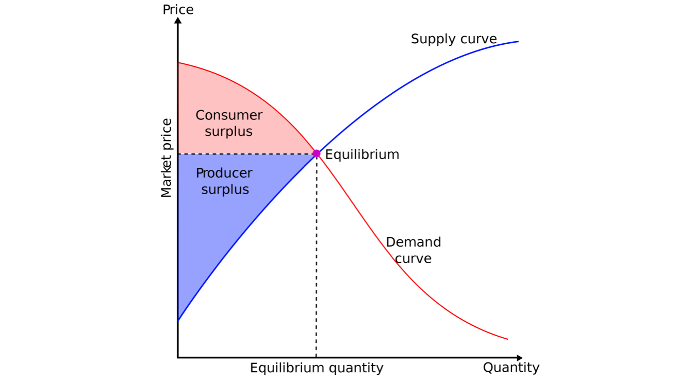
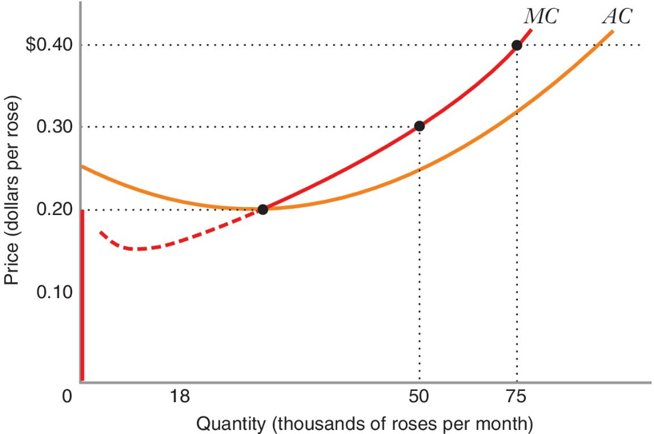
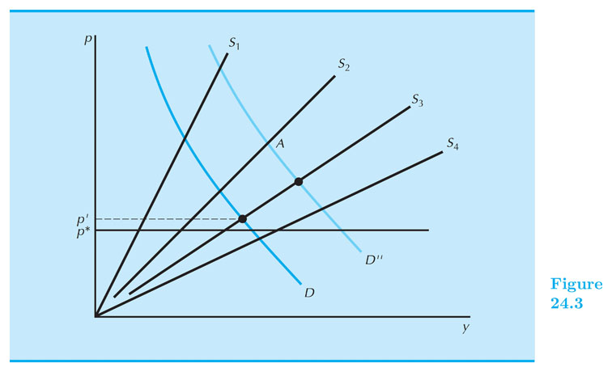
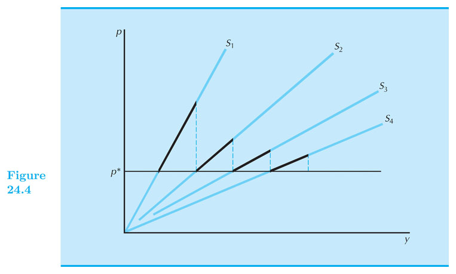
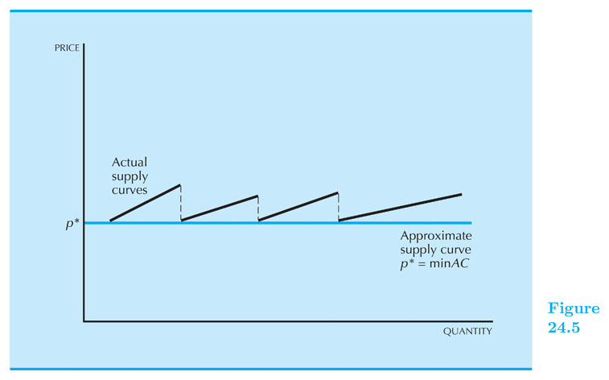
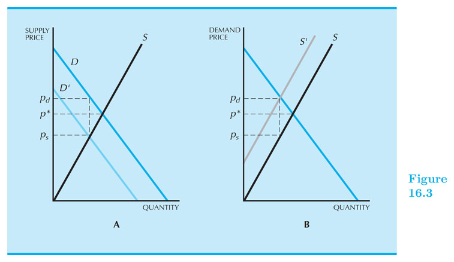
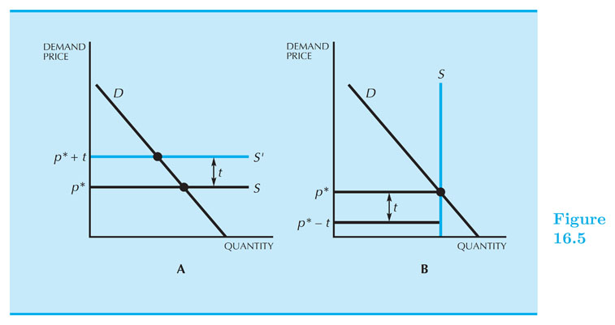
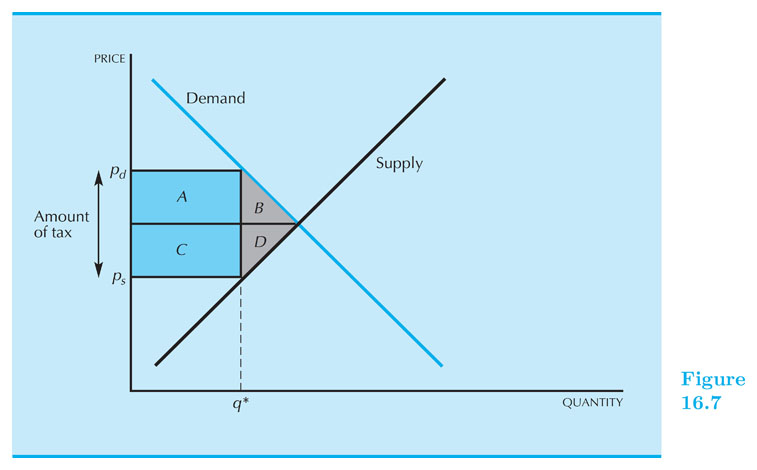

## (Competitive Market) Equilibrium

#### Intermediate Microeconomics (Econ 100A)

#### Kristian López Vargas

#### UCSC - Spring 2017

---------

## Demand - Determinants of the Demand Curve (reminder)

Demand Shifters can either have a positive (right shift) or negative (left shift) to the demand curve.

Shifts in Demand can be caused by:

* *Number of Buyers*

* *Change In Consumer Preferences*

* *Price of Other Goods*

* *Income*

* *Expectations of buyers*

------

## The Demand Curve & Surplus

The demand curve represents how much all consumers want to buy (or **demand**) at each **price** level.

**Consumer Surplus:** is the difference between the amount that *consumers* are willling and able to pay for a good or service and what they actually pay.

**Consumer Surplus** acts as a measure of *consumer welfare*.

------

## Consumer Surplus

------

## Supply - Determinants of the Supply curve (reminder)

Supply Shifters are changes in the conditions of production that can have a positive, or negative effect on the supply curve.

Examples of Shifts in Supply,

* *Number of Sellers*

* *Resource Prices*

* *Technology*

* *Taxes and Subsidies*

* *Expectations of Producers*

* *Prices of Other Goods the Firm Could Produce*

------

## The Producer Surplus

**Producer Surplus** is the difference between what **producers** are willing and able to accept for each good they supply and the price they actually receive.

The **producer surplus** is a measure of *producers'* benefit.

<!---Graph on Producer suplus?-->

------

## Producer Surplus

--------------------

## Market Equilibrium 

The demand and supply curves summarize the optimal choices of all agents involved.

If price is below my valuation I want to buy more. Similar for sellers: if p > MC, I want to sell more.

**Equilibrium price:** Price $ p^\* $ such that $ Q^d (p^\*) = Q^s (p^\*) $

What if $ p \neq p^\* $ ? agents exert pressure on market price towards equilibrium level.

We will use $ Q^d (p) $ or $ D(p) $ interchangeably. Similar for $ Q^s (p) $ or $ S(p) $.

------

## Total Surplus

------

## Market Equilibrium 

We reach **economic efficiency** in the market, when total surplus is maximized.

*"All gains from trade (between buyers and suppliers) are exhausted at the efficient point."*

It turns out that under competitive conditions, price mechanism is indeed efficient. There is no better way to maximize total surplus.

<!---

------

## Which is more important: demand or supply?

Equilibrium price is set by **both** forces of Demand and Supply, for *most* cases.

*Two cases* in which only one of the factors determines equilibrium price:

* CASE 1: Completely Vertical, or Fixed, Supply (think 200 seats in a theater). Here, *Demand* is the sole determiner of price.

* CASE 2: Completely Horizontal Supply (think unlimited supply & suppliers). Here, *Supply* will determine the price.

-->

<!----- Maybe a graph to illustrate?-->

<!----- Google Marshallian Scissors for fun (can we add this)? ---> 

------

## Equilibrium with Linear Curves

Let us find the equilibrium price, $ p^\* $, by equating the Supply and Demand functions.

$ D(p) = a - bp $

$ S(p) = c + dp $

1. To find eqm price, set $ D(p) = S(p) $ (solving...) $ p^\* = \\frac{a-c}{d+b} $

2. To find equilibrium quantity demanded, replace $ p^\* $ into $ D(p) $ or $ S(p) $ (solving...) $ Q^\* = \\frac{ad + bc}{d+b} $

------

## Inverse Demand and Supply Curves

Calculating the Inverse simply implies solving for price in the respective equation.

If $ Q^d = f(p) $, then the inverse demand is $ p = f^{-1}( Q^d ) $

------

<!-- * For example: An easy way to calculate Total Revenue function is to take the Inverse Demand and multiply it by quantity: $ TR(Q) = f^{-1} (Q) * Q $ -->

<!--
------

## Inverse Demand and Supply Curves - Example

* Let's practice finding the Marginal Revenue of this Demand Function $ Q^d = 240 - 2p $

    * Remember: $ \\frac{\\partial TR}{\\partial Q} = MR $

    * $ Q^d = 240 - 2p $, so inverse demand $ p = 120 - Q/2$

    * $ TR(Q) = (120 - Q/2)Q $, so $ MR(Q) = 120 - Q $
-->

## Inverse D(p) and S(p) Curves - Home Exercise

Assume you are in the short run of the industry. Number of firms is fixed.

Take the linear demand and linear supply of our previous example and calculate the inverse demand and supply curves.

Now equate the inverse demand and the inverse supply to find the equilibrium quantity Q*.

Replace Q* in the inverse demand (or inverse supply) to find the equilibrium price.

You should have obtained the same solutions:

$ Q^\* = \\frac{ad + bc}{d+b} $ and $ p^\* = \\frac{a-c}{d+b} $

------

## The long run of the industry (or the market)

------

## The long run of the industry

The long run in the industry is the time horizon in which:

* All the firm’s inputs and production factors can be adjusted, and,

* The number of firms in the industry can increase or decrease. Firms will enter if profits $ \\geq 0 $, firms exit if profits are $ < 0 $ .

------

## EQUILIBRIUM in the long run of the industry

* Definition of **equilibrium in the long run of the industry $ (P,Q,q,J) $**:

    * Price level such that every one that wants to buy (sell) is able. $ Q_d(P) = Q_s(P) $

    * Firms produce q that maximize profits adjusting all inputs: for each firm:  $ P = MC(q) $  and  $ P \\geq AC $

    * If $ P > \\text{min} AC $, firms keep entering the market, supply keeps shifting rightwards, until profits are zero: That is:  $ P = \\text{min} AC(q) $. 
    
    (J = # of firms).

------

## The long run of the industry

* Let $ p^\* $ be the minimum $ AC $; and $ S_j $ is the market supply with $ j $ firms.

------

## The long run of the industry

------

## The long run of the industry

------

## The long run of the industry - Example

* Consider all firms are identical with: $$ TC(q) = 40q - q^2 + 0.01q^3 $$

* Demand curve: $ Q_d(P) = 25,000 - 1,000P $

* Find the long run equilibrium of the industry:

------

## The long run of the industry - Example (cont.)

1. Set $ P = MC $ and $ P = AC $:
    * $ MC = 40 – 2q + 0.03 q^2 = ~~ AC = 40 – q + 0.01 q^2 $
    * Solve for q: $ q^\* = 50 $
    * Replace in MC: $ P^\* = 15 $

2. Find $ Q^\* $ from market demand:
    * $ Q^\* = Q_d(P^\*)= 25,000 - 1,000 \\times 15 = 10,000 $

3. Find number of firms, J, from $ Q_s(P) = Q_d(P) = Q^\* $:
    * $ 10,000 = 50 \\times J^\* ~ $
    $ ~ J^\* = 200 $

    <!-- *  = q^\*\\times J $ -->
    <!-- * $ 25,000 - 1,000 \\times 15 = 50 \\times J $ -->

<!-- * (1.) and (2.): $ Q_d(15) = 25,000 - 1,000 \\times 15 = 10,000 $ -->

<!-- * Back to (2.): $ 10,000 = 50 \\times J^\* ~ $ so $ ~ J^\* = 200 $ -->

------

## Exercise for home (do it!)

* 10 consumers with identical cobb-douglass preferences

* 10 producers with identical cobb-douglass technology (do the DRS case: a+b<1)

* Find the market equilibrium in the short run of the industry.

* Find the market equilibrium in the LONG run of the industry.

------

## Taxes in the short run of the industry

* If there is a tax money "spent" by consumers is different than the money "kept" by sellers: $ P_D \\neq P_S $.

1. A **quantity tax** implies that part ($t) of the money paid for a unit of the good goes to the government.

    * $ P_D = P_S + t ~~ $ (assuming seller pays the tax)

    * Now consider the equilibrium price with taxes: $ D(P_D) = S(P_S) $ and substitute in the quantity tax "equation".

    * Our new equilibrium condition: $ D(P_D)=S(P_D-t) $

2. A **value tax** (or ad valorem): is a charge as a percentage of the price of the good:

    * $ P_D = (1+ \\tau ) P_S ~~ $ (assuming seller pays the tax)

    * Equilibrium condition: $ ~ D(P_D) = S\\left( \\frac{P_D}{ 1+\\tau } \\right) $

    * E.g. if tax is 9%, then ($ \\tau = 0.09 $).

_______

## Taxes - Who pays the taxes?

Suppose that the buyer pays the tax: $ P_D - t = P_S $

Note, however, this is the same equation found in our previous slide ($ P_D = P_S + t$), just expressed differently.

This indicates that it doesn't matter where the tax is levied (either on the supply or the demand side).

The burden of the tax will be distributed between sellers and buyers in the same way, regardless of the stated "intention" of the tax authority.

------

## Quantity Tax - Example

Let us consider an equation with linear supply and demand:

$ D(P_d) = a - b P_d ~ $ and $ ~ S(P_s) = c + d P_s $

A quantity tax is imposed on this good: $ P_D = P_S + t $

We want to find $ P_S^\* $ and $ P_D^\* $:

$ \\begin{align}
a - b P_D &= c + d P_s \\\\
a - b (P_s + t) &= c + d P_s \\\\
P_s^\* &= \\frac{ a-c-bt }{ d+b }
\\end{align} $

Also, $ P_D^\* = P_S^\* + t $.

-------

## Where does the burden of the tax fall?

------

## Passing Along a Tax

Two most simple cases regarding tax burden lie in the extremes of the supply curve.

1. Perfectly **elastic** supply (completely horizontal) suggest that there are unlimited firms producing a good at a certain price and zero producing at any lower price. Any firm that wants to charge more, or less, than the going rate will be out of business in no time.

2. The second case involves a perfect **inelastic** supply that suggests a good produced is fixed and no tax will move its production. In this case, none of the tax gets passed on to the consumer.

------

------

## Dead Weight Loss 

_The loss of economic benefit that comes from inefficient allocation of resources._

* With taxes there is a wedge between $ P_D $ and $ P_S $ (in fact: $ P_D > P_S $). Some transactions are lost.

* DWL is the "value" of transactions that would occur in an efficient mechanism, but do not occur due to the wedge created by the tax.

* Wait! but the government is collecting taxes right? Maybe that is enough to compensate for the loss...

* Let us see: consumers and producers lose on surplus more than what the government collects in tax revenue!

------

------

## Dead Weight Loss - Example

Demand: $ Q^d = 10 - 0.5 P^d $

Supply: $Q^{s}= \\text{max}(-2+P^s, 0) $

1.- **Find first the equilibrium with no tax:**

* $ Q^{d} = Q^{s} $ and $ P^{s} = P^{d} = P^\* $

* Solving: $ P^\* = 8 $ and $ Q^\* = 6 $

------

## Dead Weight Loss - Example

2.- **Now consider a quantity tax of  $6 and find the *equilibrium with tax*:**

* Equilibrium satisfies now two equations:

* $ P^d = P^s + 6 $ and $ Q^d = Q^s $

* Then: $ 10 - 0.5 (P^s+6) = -2 + P^s $

* ...Solve for $ P^s $

* $ P^s =6 $; $ P^d = 12 $; $ Q^\* = 4 $

<!--

// This piece of code below creates the reveal presentation and pushes to GitHub and then deploys to GitHub pages. Modify the commit message and paste it into terminal.

cd docs && \
pandoc  \
-t revealjs -V revealjs-url=reveal.js \
--css=reveal.js/css/theme/simple.css \
-H reveal.js/js/revealMathJax.js \
-s S12_Equilibrium_Ch16.md -o S12_Equilibrium_Ch16.html && \
cd ..

cd docs && \
pandoc  \
-t revealjs -V revealjs-url=reveal.js \
--css=reveal.js/css/theme/simple.css \
-H reveal.js/js/revealMathJax.js \
-s S12_Equilibrium_Ch16.md -o S12_Equilibrium_Ch16.html && \
cd .. && \
git add docs/S12_Equilibrium_Ch16.html && \
git commit -am " add content to S12_Equilibrium_Ch16.md " && \
git push origin master && \
mkdocs gh-deploy 

-->