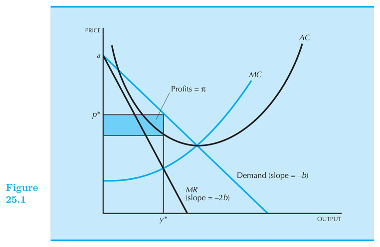
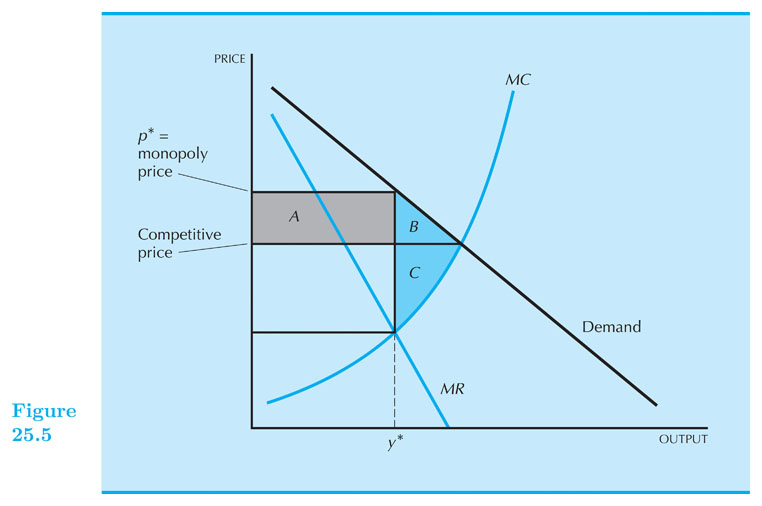
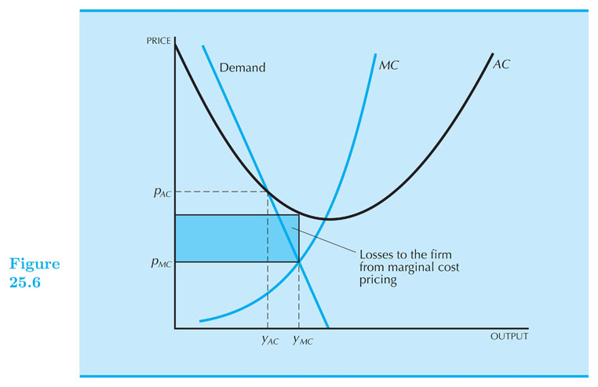
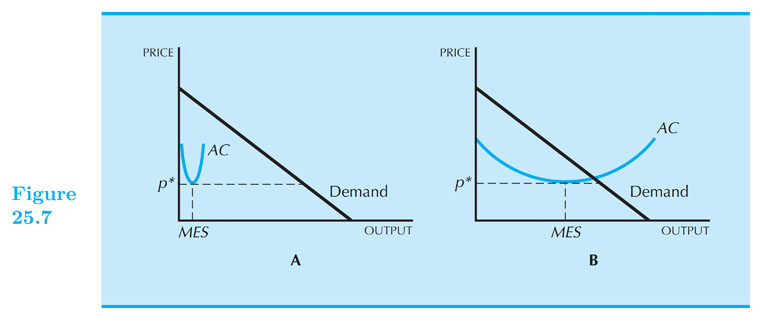

## Monopoly 

#### Intermediate Microeconomics (Econ 100A)

#### Kristian López Vargas

#### UCSC - Spring 2017

---------

## Monopoly

* A monopoly is the exclusive possession of an industry's supply.

* In a competitive market, producers determine best quantity for a given price (firms are **price-takers**).

* In monopoly, the firm can **either** determine the price and consumers decide how many units to buy (demand curve), or, equivalently, the firm determines the output and consumers determine the price (inverse demand $ p(q) $ ). We adopt the latter approach.

* Monopolist cannot determine arbitrary q and p at the same time - the monopolist keeps in mind the demand of the consumer as a restriction, and chooses $ q $ in order to maximize profit ($ \\pi = p(q) \\times q $).

------

# Reminder

* Total Revenue: $ TR(q) = p \\times q $

* Total revenue of a competitive firm is linear in q, because the price is given for the firm.

* Total revenue of the monopolist not linear because the price changes with quantity ( $ p(q) $ ).

* Make sure you understand this well before you continue.

------

## Monopolist Maximizing Profits

The monopolist's **profit-maximization problem**:

Maximize profits: $ ~ \\text{max}_q: \\pi(q) = TR(q) - c(q) $.

That is, we want to choose $ q $ that gives highest profit:

At the peak of the profit "hill" it must be flat, right? This is what mathematically we called the first-order condition:

$ \\frac{d\\pi}{dq} = \\frac{dTR}{dq} - \\frac{dc}{dq} = 0 $

In other words, monopolist wants to produce $ q $ such that:

$ MR(q) = MC(q) $

We often denote this quantity as $ q^M $.

--------

## Solving the problem graphically

* see document camera

--------

## Monopolist - Marginal Revenue

Let's look at $ MR(q) $ more closely (reminder: although we do not always write it like that, remember $ p $ always represents the _inverse demand_, $ p(q) $, in the monopoly case).

Since $ ~ TR(q) = p(q) \\times q $, then:

$ \\begin{align}
 MR(q)  &= \\frac{d TR(q)}{ d q} \\\\
        &= p + q \\frac{dp}{ d q} \\\\
        &= p + q \\frac{dp}{ d q} \\frac{p}{p} \\\\
        &= p ( 1 +  \\frac{dp}{ d q} \\frac{q}{p}) \\\\
        &= p \\left( 1 +  \\frac{1}{ \\epsilon(q)} \\right) \\\\
        &= p \\left( 1 -  \\frac{1}{ | \\epsilon(q) | } \\right)
\\end{align} $

------

## Back to Maximizing Profits

Remember to maximize profits we want: $ ~ MR(q) = MC(q) $

But we just learned that: $ ~ MR(q) = p \\left( 1 -  \\frac{1}{ | \\epsilon(q) | } \\right) $

Therefore: $ ~ p \\left( 1 -  \\frac{1}{ | \\epsilon(q) | } \\right) = MC(q) $

Since $ \\left( 1 -  1/ | \\epsilon(q) | \\right) < 1 $, the monopolist will set $ p > MC $. That is, the consumer pays more for an extra unit of production than what it costs **society** to produce that unit. _Inefficiency!_

In contrast, in a competitive markets we had: $ price = MC $.

Also, notice that monopolist produces at a $ q^M $ such that: $ |\\epsilon| > 1 $

------

--------------
 
## Monopoly in a Linear Demand Curve - Example

A monopolist, faces a linear inverse demand curve $ ~ p = a - b q ~ $, and has this cost function $ ~c(q) = c q ~$, for $ ~ a, b, c > 0 ~ $:

The profit maximization problem is: $ ~ \\text{max}_q ~~ \\pi = TR(q) - c(q) = (a-bq) q - cq  $

(1) Find _marginal revenue_ and _marginal cost_ functions: $ ~~ MR(q) = a - 2bq ~~$ and $ ~~ MC(q) = c $

(2) Equate the two and solve for q: $ a-2bq = c ~~ $. It follows that:  $ ~ q^M = \\frac{(a-c)}{2b} $

(3) Plug $ q^M $ into inverse demand and find the price of the monopolist: $ ~ p^M = \\frac{(a+c)}{2} $

-------

 
 
-------
 
## Numerical Example! (home)

SC Municipal Utility is the sole provider of water to Santa Cruz residents and faces the following demand for water (in gallons): $ q^d = 100 - p $. Also, $ TC = 2q $.

**Step 0:** Inverse Demand: $ p = 100 - q^d $

**Step 1:** Find MR and MC

$ TR = Pq = (100 - q)~q = 100q -q^2 $  

$ MR = \\frac{dTR}{dq} = 100 - 2q ~ $ and $ ~ MC = \\frac{dTC}{dq} = 2 $

**Step 2:** Set MR = MC  and find $ q^M $

$ 2 = 100 - 2q ~ $, then: $ ~q^M = 49 $

**Step 3:** Find $ p^M $ by plugging in $ q^M $ into the inverse demand:

$ p^M = 100 - q^M = 51 $ 

--------

## Inefficiencies Of Monopoly
 
While a competitive industry operates where ***price = marginal cost***, monopolized industry operates where ***price > marginal cost***; which results in lower output.
 
Consumers are typically worse off under a monopoly: Suppose you are willing to pay 7 dollars for a burrito, while $ MC = 5 $ and $ P_M = 10 $. Sorry, you don’t get to buy it…

In a monopoly, there are consumers that are willing to pay more than what it would cost to make those extra units (MC), but they are priced out. This would not happen in a competitive market.

-------

## Inefficiencies Of Monopoly - Prices and Quantity

Let us consider $ (Q_M,P_M) $ as the optimal production set of a monopolist and $ (Q_C,P_C) $ the optimal production for a competitive firm.

---------

## Inefficiencies Of Monopoly - Deadweight Loss
 
B + C represent the DWL; If pricing is competitive consumers would gain area A + B.

---------

## Inefficiencies Of Monopoly - Deadweight Loss

Interactive version:

<iframe

src="https://www.desmos.com/calculator/f3poa8u4dm?embed"

style="border:0px #FFFFFF none;" name="myiFrame" scrolling="auto" frameborder="0" marginheight="0px" marginwidth="0px" height="600px" width="700px"

></iframe>

------

## Patents and Patent Thickets (readings)

A **patent** is a license from the government that offers exclusive rights to produce an invention.

The life of a patent in the United States is 17 years.

A **patent thicket** refers to the dense and overlapping series of patents an incumbent company might own to fend off competition.
 
Companies can file a *"preliminary injunction"* against a company they feel infringes on their patents.

Top tier companies arm themselves with dense patent thickets. 

Owning a dense thicket allows protection from injunctions due to the fear of a counter injunction.

---------

## Natural Monopoly 

* A **natural monopoly** occurs generally when there are

    - **high fixed costs**

    - **low marginal costs**.
   
* Examples of natural monopolies include the gas network, electricity grid, and railway infrastructure.

------

## Natural Monopoly

If a natural monopoly is forced to operate at a competitive market's price, $ MC = price $, it would incur in loses from producing under the $ AC $ curve.

----------

## What Causes Monopolies? 

Remember that a monopolist **IS** the whole of the supply side of a product.

A monopolist must then have the means of producing the large volume of product. 
 
The **minimum efficient scale (MES)** represents the level of output that **minimizes average cost**. 

A monopolist must then have a large **minimum efficient scale** $ \underline{relative} $ to the demand.

--------

## What Causes Monopolies? (readings)

Graph A represents a demand much larger relative to the MES. 

Graph B has a comparable MES relative to demand .
 
 
-------

## Cartels (readings)

A **cartel** occurs when a few firms decide to collude and artificially hike prices to monopoly levels and drive out competition. 

The biggest cartel in the world is OPEC, owning 80% of the worlds reserves in oil. 

Price fixing is illegal in the United States; the US courts do not have jurisdiction to try foreign anti-trust cases.

OPEC has used their influence to cause a massive shortage of gasoline. In 1973, due to retaliation from US involvement in the Yom Kippur War, OPEC imposed an oil embargo.

--------

##Tax Effects on a Monopolist Graphically (readings)

Let us examine what would happen to price if we imposed a quantity tax on the market.

If we were to gear the tax towards the monopolist, the price of output would increase marginal cost by the tax ($ MC + t $)

In the case of a linear demand curve, where the marginal revenue is twice as steep demand curve, the price goes up by *half the amount of the tax*

-------

## Monopoly behavior beyond unique, uniform pricing

* Perfect price discrimination: charging each customer a different price. Efficient level of output BUT CS = 0.

* Charge different prices in two different markets: Firm will charge the lower price in the market where demand is more elastic.

* If monopolist can set a two-part tariff: it will want to set price equal to MC and make all of its profits from the entry fee.

-------

<!--

// This piece of code below creates the reveal presentation and pushes to GitHub and then deploys to GitHub pages. Modify the commit message and paste it into terminal.

cd docs && \
pandoc  \
-t revealjs -V revealjs-url=reveal.js \
--css=reveal.js/css/theme/simple.css \
-H reveal.js/js/revealMathJax.js \
-s S13_Monopoly_Ch25.md -o S13_Monopoly_Ch25.html && \
cd .. && \
git add docs/* && \
git commit -am " add content to S13_Monopoly_Ch25.md " && \
git push origin master && \
mkdocs gh-deploy 

-->