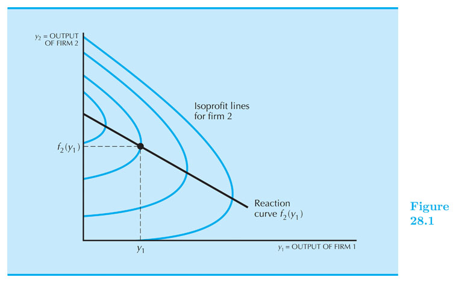
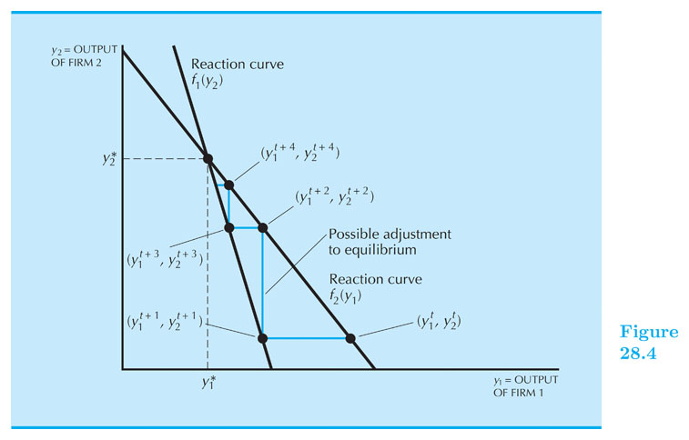
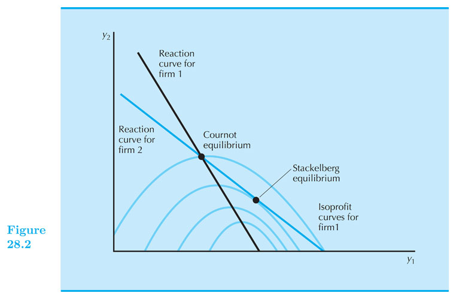

## Oligopoly

#### Intermediate Microeconomics (Econ 100A)

#### Kristian López Vargas

#### UCSC - Spring 2017

------------------------

## Oligopoly

Oligopoly is the study of a market served by a **small number** of firms.

  * Duopoly is simplest case: 2 firms.

  * There is an strategic component because agents are no longer tiny with respect to the whole market.

There is no general solution to the equilibrium of this market. It will depend on market structure and specifics of how firms interact.

------

## Scenarios and theories

* Collusive 
    * cartels

* Non-collusive
    * Simultaneous moves
        * Cournot: quantity setting  
        * Bertrand: price setting  

    * Sequential moves
        * Stackelberg: leader-follower quantity setting  
        * price leader: leader-follower price setting 
    
------

## Collusion

Firms get together to maximize **joint** profits; together they act like a monopolist.

Total quantity: $ Q = q_1 + q_2 ~ $;  Inverse demand: $ ~ p(Q) = p(q_1 + q_2) $

Cartel profit: $ ~ \\pi(q_1,q_2) = p(q_1 + q_2) \\times (q_1 + q_2) − c(q_1) − c(q_2) $

Cartel problem: $ ~ \\text{max}_{q_1, q_2} : p(q_1 + q_2) \\times (q_1 + q_2) − c(q_1) − c(q_2) $

Solution, FOCs:

WRT $ q_1 $: $ ~~ p(q_1+q_2) + \\frac{dp}{dq_1} \\times (q_1 + q_2) = MC(q_1) $

WRT $ q_2 $: $ ~~ p(q_1+q_2) + \\frac{dp}{dq_2} \\times (q_1 + q_2) = MC(q_2) $

In sum: Cartel's MR must equate $ MC(q_1) \\text{ and } MC(q_2) $

------

## Cartel - Linear Case

Market Inverse Demand: $ p = a - bQ = a - b(q_1 + q_2) $

Costs: $ TC_i = c q_i ~~ $, so $ MC_i = c $

Cartel profit: $ \\pi(q_1 + q_2) = p \\times (q_1 + q_2) - c q_1 - c q_2 $

Cartel profit: $ \\pi(q_1 + q_2) = (a - bq_1 - bq_2) (q_1 + q_2) - c q_1 - c q_2 $

FOC wrt q1: $ ~~  a - 2 b q_1  - 2 b q_2 = c $

This implies: $ q_1 + q_2 =  \\frac{a-c}{2b} $

If firms divide production equally: $ q_1^{cartel} = q_2^{cartel} =  \\frac{a-c}{4b} $

-----

## The economics of collusion

But, Wait! why don't we see more cartels in real life? Laws and, maybe more importantly, cartels are hard to sustain.

Cartels have instability built-in: if firm 1 believes firm 2 will indeed follow the agreement, then it should increase its own output.

And if a firm believes the other firm will not keep its word, then it should cheat first.

------

## Cournot Oligopoly - Linear Case

Market Inverse Demand: $ p = a - bQ = a - b(q_1 + q_2) $

Costs: $ TC_i = c q_i ~~ $, so $ MC_i = c $

F1's profit: $ \\pi(q_1) = p \\times q_1 - c q_1 $

That is: $ \\pi(q_1) = (a - b q_1 - b q_2^e) q_1 - c q_1 $

FOC wrt q1: $ ~~  a - 2 b q_1  - b q_2^e = c $

This implies the following reaction (or "best response") function:

$ q_1 = \\frac{a-c}{2b} - \\frac{q_2^e}{2} $

------

## Cournot Oligopoly - Linear Case (cont.)

This reaction fn is F1's best response to his/her believe regarding F2's behavior, $ q_2^e $.

Similarly, we maximize firm 2's profit to find F2's reaction function:

FOC wrt $ q_2 $: $ ~~  a - 2 b q_2  - b q_1^e = c $

Which implies this reaction function (aka best response fn):

$ q_2 = \\frac{a-c}{2b} - \\frac{q_1^e}{2} $

Solving $ q_1, q_2 $ from the system of two reaction functions yields.

Cournot Equilibrium: $ ~~q_1^C = q_2^C = \\frac{a-c}{3b} ~~ $, and
$ ~~p^C = \\frac{a+2c}{3} $

------

## Cournot Oligopoly - General Case

Cournot Oligopoly: simultaneous, non-collusive quantity setting.

Each firm makes a choice of output, $ q_i $, given its forecast of the other firm’s output, $ q_j^e $

If, for example, $ q_1 $ = chosen output of firm 1, and $ q^e_2 $ = firm 1’s beliefs about firm 2’s chosen output.

Then, firm 1's maximization problem: $ ~~ \\text{max}_{q_1}: \\pi_1(q_1 ~| q^e_2) = p( q_1 + q^e_2) \\times q_1 − c(q_1) $

------

## Cournot Oligopoly - General Case

Solution - Firm 1's FOC: $ ~~ \\frac{d \\pi_1}{d q_1} = 0 ~~ $  Then: $ p(q_1 + q^e_2) + \\frac{dp}{dq_1} \\times q_1 = MC_1(q_1) $

Solving for q1, this gives firm 1’s reaction curve: $ q_1 = f_1(q^e_2) $

Similarly, firm 2 also has a reaction curve: $ q_2 = f_2(q^e_1) $

Cournot Equilibrium: $ ~~q_1^C = q^e_1 $, $ ~~q_2^C = q^e_2 $, $ ~~p^C = p(q_1^C + q_2^C) $

Cournot equilibrium — each firm finds its expectations confirmed in equilibrium

------

------

------

## More than two firms in Cournot Oligopoly

Suppose now that there are $ n $ firms, and let $ Q = q_1 +...+ q_n $ be the total output.

Since $ \\pi(q_i) = p(Q) \\times q_i - c(q_i) $, we can use the fact that $ \\frac{dp}{dq_i} = \\frac{dp}{dQ} $ to write the FOCs of firm $ i $ as follows: $ p(Q) + \\frac{dp}{dQ}q_i = MC(q_i) ~$, where the left-hand side is simply the MR of firm $ i $.

There are a total of $ n $ FOC equations like this one (since $ i = \{1,2,3,...,n\} $ ) and so you have a system of _n equations and n unknowns_ that you can solve to find $ q_1^C, q_2^C, ... , q_n^C $ .

In the case of the the linear inverse demand (p = a - bQ) and constant MC (MC = c), the equilibrim of the _n-firm Cournot oligopoly_ is given by:

$ ~~q_i^C = \\frac{a-c}{(n+1)b} ~~ $, and $ ~~p^C = \\frac{a+nc}{n+1} ~ $

Do this interesting exercise at home and think about what happens when $ n \\rightarrow \\infty $

----------

## Simultaneous Price Setting - Bertrand Oligopoly

What if, instead of setting quantities, firms set prices and allowed consumer to decide how much to buy? This is called a **Bertrand Oligopoly**.

In the equilibrium a la Bertrand, each firms sets a price such that, given the prices of other firms, she cannot obtain a higher profit by choosing a different price.

----------

## Bertrand Oligopoly - Equilibrium

Suppose two firms have identical costs (say, MC = $c) and they produce identical goods.

Firm $ 1 $ believes the other will charge $ p_2 $ and decides to charge $ p_1 $ upon that belief. Both set prices simultaneously.

Because any firm that undercuts its rival captures the entire market and earns positive profit, firms will undercut each other until they hit their MC. That is, while possible $ p_1 $ will always be set just below $ p_2^e $ or at mc if $ mc > p_2^e $.

These incentives make the simultaneous price setters to push their price down to the **Bertrand Equilibrium**:

Equilibrium price = MC:  $ p_1^B = p_2^B = MC $, $ Q^B $ can be found from the market demand curve.

---------

## Bertrand Equilibrium

---------

## Bertrand - Home Exercise

Suppose $ MC_1 = 4 $ and $ MC_1 = 5 $, and prices can be set in pennies at the least.

What is the Bertrand Equilibrium?

------

## Sequential Competition

## Quantity Leadership - Stackelberg

Let us assume there are two firms that produce identical products and have identical cost.

**Quantity Leadership:** there is a leader and a follower that set their quantities in sequential order.

The leader (F1): larger, more dominant firm in the market, sets its quantity first ( $ q_1 $ ).

The follower (F2): smaller firm, observes the leader's behavior and then sets its quantity second ( $ q_2 $ ).

As before, the total market output is $ Q = q_1 + q_2 $.

------

## Quantity Leadership - Stackelberg Oligopoly

The leader is aware that the follower will act after him, and so that the follower will affect the market price. The leader then needs to analyze what the **follower** will choose.

That is the leader will "solve" the follower's problem, first. Then she incorporates that insight to find out her optimal leader output level.

We call this "backward induction" solution.

------

## Stackelberg Oligopoly

The Follower's Profit maximization is:

$ \\text{max}_{q_2}: {\\pi}_2 =  p(q_1 + q_2) \\times q_2 - c_2(q_2) $

Where output of the leader is treated as a constant. Finding MR = MC:

$ MR_2 = p(q_1 + q_2) + \\frac{\\partial p}{\\partial q}q_2 = MC_2 $

This looks a lot like a monopolist's maximization except with a "residual demand" (demand that the leader left unserved). So the profit maximizing choice will depend on the choices of the leader.

Solving for q_2 from that FOC we can get the follower's reaction function:

$ q_2 = f_2(q_1) $

--------

## Stackelberg Oligopoly

The Leader's Profit maximization is:

$ \\text{max}_{q_1}: {\\pi}_1 =  p(q_1 + f_2(q_1)) \\times q_1 - c_1(q_1) $

Where output of the follower is NOT treated as a constant.

As always, the leader solves for his optimal $ q_1^S $ by doing:

$ \\frac{ d {\\pi}_1 }{ d q_1 } = 0 ~~ $ to obtain: $ q_1^S $

Equilibrum: $ q_1^S ~~$, $ q_2^S = f_2(q_1^S) ~~$, $ p^S = p(q_1^S + q_2^S) $.

-----------

## Stackelberg Oligopoly - Linear Example

Market Inverse Demand: $ p = a - bQ = a - b(q_1 + q_2) ~$. Costs: $ TC_i = c q_i ~~ $, so $ MC_i = c $

Finding Stackelberg Equilibrium

Step 1: Leader "solves" followers problem: $ ~~ \\text{max}_{q_2}: {\\pi}_2 =  (a - b(q_1 + q_2)) ~ q_2 - c ~ q_2 $

We make $ d \\pi_2 / d q_2  = 0 $ and find solution -> the follower's reaction function: $ q_2 = f_2(q_1) = \\frac{a−c}{2b} − \\frac{1}{2} q_1 $

------

## Stackelberg Oligopoly - Linear Example (2)

Step 2: Leader solves his problem with the insight of step 1: $ ~~ \\text{max}_{q_1}: {\\pi}_1 =  (a - b(q_1 + f_2(q_1) )) ~ q_1 - c ~ q_1 $

That is: $ ~~ \\text{max}_{q_1}: {\\pi}_1 =  (a - b(q_1 + \\frac{a−c}{2b} − \\frac{1}{2} q_1  )) ~ q_1 - c ~ q_1 $

We make $ d \\pi_1 / d q_1  = 0 $ and find solution -> the leaders's final optimal output: $ q_1^S = \\frac{a-c}{2b} $

Step 3: Using $ ~q_1^S $, calculate $ ~q_2=f_2(q_1) $, $ ~Q = q_1 + q_2 $, and $ ~p^S = a - b Q $

Stackelberg Equilibrium: $ q_1^S = \\frac{a-c}{2b} ~$, $ q_2^S = f_2(q_1) = \\frac{a-c}{4b} ~$, $ p^S = \\frac{a + 3c}{4} $

----------

## Stackelberg Equilibrium

----------

<!--

// This piece of code below creates the reveal presentation and pushes to GitHub and then deploys to GitHub pages. Modify the commit message and paste it into terminal.

cd docs && \
pandoc  \
-t revealjs -V revealjs-url=reveal.js \
--css=reveal.js/css/theme/simple.css \
-H reveal.js/js/revealMathJax.js \
-s S14_Oligopoly_Ch28.md -o S14_Oligopoly_Ch28.html && \
cd .. && \
git add docs/* && \
git commit -am " add content to S14_Oligopoly_Ch28.md " && \
git push origin master && \
mkdocs gh-deploy 

-->