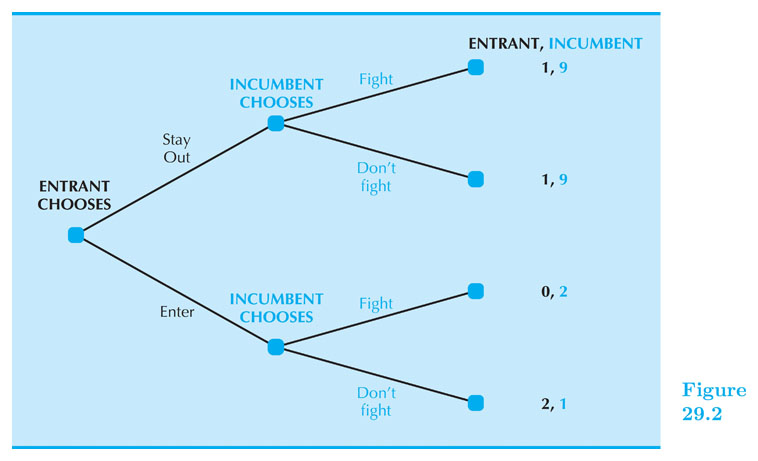
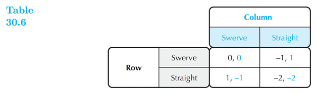

## Game Theory

#### Intermediate Microeconomics (Econ 100A)

#### Kristian López Vargas

#### UCSC - Spring 2017

--------

## Game Theory

In competitive markets or in a monopoly there is no reason to think about any specific competitor.

BUT many other economic interactions do not have that core feature and agents do find themselves in interdependent / strategic interactions.

Interdependence (or strategic interdependence) means that my satisfaction or profit depends on my actions AND the actions of at least one other specific player. Therefore, I need to care for what s/he does or does not... I use a strategy.

A **game** is an interaction with strategic interdependence.

--------

## Types of Games

Timing:

* Static Games: Each player acts simultaneously, only once and has complete information about the payoff functions but imperfect information about rivals’ moves.

* Dynamic Games: Players act sequentially. Usually assumed that each player has perfect recall of what happened prior to his/her turn to decide.

Information:

* Complete information (payoff function is common knowledge among all players) is different from

* Perfect information (player knows full history of game up to the point he is about to move)

--------

## Game Theory - Static, Simultaneous-Move Games

Unless stated otherwise,  we will assume  we are in a "one-shot" (one round only) interaction.

Payoff's will be apparent to the players after the choices have been made (simultaneous game).

Typically, we use a **payoff matrix** that arranges all the possible outcomes a game can have.

--------

## Static Games - Representation

* We use a payoff matrix when we have few strategies per player.

------------------

## Best Response Correspondence

The **best response correspondence** is the choice a player will make that will maximize her payoff, given the other players strategy.

If there is more than one optimal response; your best response will be all of the choices in the set.

See examples in document camera.

------

## Dominant Strategy

A strategy $ s $ is a **dominant strategy** if it produces higher payoff than other strategies regardless of rivals’ strategies.

In other words, if a player has an optimal strategy irrespective of the other player's move, such a strategy is the "dominant strategy".

See examples in document camera.

A strategy $ s' $ is a “dominated strategy” if for every strategy played by the opponent, there is another action the player can take and obtain higher payoff than with $ s' $.

If the best response set does not vary with what the opponent chooses and is unique, then the only strategy in the best response set is the dominant strategy.

-------

## Dominant Strategy equilibrium

**Dominant strategy equilibrium** represents the combination of strategies that players in the game arrive at when everyone has used their own *dominant strategy*.

There can be a dominant strategy equilibrium only when all players have a dominant strategy.

------

## Nash Equilibrium

We say that a set of strategies in a game forms a **Nash Equilibrium** if:

* Agents are MUTUALLY BEST RESPONDING to each other's played strategies. So no player has an incentive to deviate from what they are playing.

* When all other players use in fact those strategies, one cannot obtain a higher playoff by choosing a different strategy.

Example: Cournot's equilibrium.

------

## Nash Equilibrium in Pure Strategies

NE: (Player A, Top); (Player A, Left)

------

## Mixed Strategies

So far, players have used pure strategies, which means that each player chooses a single action.

A mixed strategy is when a player chooses among possible actions probabilistically (flipping coins, tossing the dice, etc.)

A pure strategy assigns a probability of 1 to a single action, and zero to the other actions.

In a mixed strategy, more than one strategy receives a probability greater than zero.

-------

## OK, but WHY Mixed Strategies?

* Practical point of view: In some games you want to be unpredictable
    * Tennis service
    * Penalty kick in football
    * Poker
    * War

* Mathematical point of view:
    * Needed if pure strategy equilibria do not exist
    * May coexist with pure strategy NE

------

## Mixed Strategies - Example

Calculate expected payoff if both players play 50/50 chances between their strategies:

---------

## Best response curves (in simultaneous games)

Let's go deeper into finding mixed strategy Nash Equilibria

Consider the simple game in which the players are given the matrix beforehand-

Suppose $ b_c(r) $ is the best response for column player and $ b_r(c) $ is the best response for player row.

**Nash Equilibrium** is the strategy profile ($ r^\* $, $ c^\* $) such that: $ c^\* = b_c(r^\*) ~~ $ and $ ~ r^\* = b_r(c^\*) $

N.E. in pure strategies: NE1: $ ~(r^\* = Top $ , $ c^\* = Left) ~$ and NE2: $ ~(r^\* = Bottom$ , $ c^\* = Right) ~$

-------------

## Best response curves - adding mixed Strategies

Let's add mixed strategies to what we know about best response curves.

$ r = $ probability row plays top. $ 1-r $ probability row plays bottom.

$ c = $ probability column plays left. $ 1-c $ probability column plays right.

We have pure strategies is $ r $ and $ c $ are equal to either 0 or 1.

Let's now calculate the payoff of the row and the columns

------------

## Best response curves - adding mixed Strategies

| Combination 	| Probability 	  | Row's Payoff 	| Column's Payoff 	|
|-------------	|-------------	  |--------------	|-----------------	|
| Top, Left   	| $ r ~ c $       | 2            	| 1               	|
| B, L        	| $ (1-r)~c $     | 0            	| 0               	|
| T, R        	| $ r~(1-c) $     | 0            	| 0               	|
| B, R        	| $ (1-r)~(1-c) $ | 1            	| 2               	|

------------

## Calculating Row's Expected Payoff

Row's Expected  Payoff becomes:

$ \\pi_{row}(r,c) = 2rc+ (1-r)(1-c) = 2rc+1-r-c +rc = (3c - 1)r + (1- c) $

Row chooses $ r $ so the key term is $ (3c - 1) $

This implies:

$
r^\*(c)=
\\begin{cases}
0 ~~~if ~c < 1/3 \\\\
1 ~~~if ~c > 1/3 \\\\
\[0,1 \] ~~~if ~c = 1/3 \\\\
\\end{cases}
$

<!-- Now suppose that row consider increasing $ r $ by $ \\Delta{r} $ -->

<!-- $ \\Delta{\\pi_{row}(r,c)} = \\pi_{row}(r+\\Delta{r} ,c) - \\pi_{row}(r,c) =  (3c - 1)\\Delta{r} $ -->

<!-- When is this expression positive and when is it negative? -->

<!-- We want to increase $ r $ when $ c > 1/3 $, decrease $ r $ if $ c < 1/3 $ and do nothing if $ 0 \\le r \\le 1 $ when $ c = 1/3 $ -->

-----------

## Calculating Column's Expected Payoff

Columns's Expected Payoff becomes:

$ \\pi_{column}(r,c) = rc+ 2(1-r)(1-c) = rc + 2 - 2r - 2c + 2rc = (3r - 2)c + 2(1 - r) $

Columns chooses $ c $ so the key term is $ (3r - 2) $

This implies:

$
c^\*(r)=
\\begin{cases}
0 ~~~if ~r < 2/3 \\\\
1 ~~~if ~r > 2/3 \\\\
\[0,1 \] ~~~if ~r = 2/3 \\\\
\\end{cases}
$

------------

## Best Response Curves

Let's draw then: How many Equilibria do you see?

------

## Sequential Games

Consider the following "The new entry game" where the Incumbent can choose to drive prices down if the entrant joins the market.

Key concepts: Decision node; Proper subgame; Strategy vs. Action; Payoff pairs.

-------

## Sequential Games - Key concepts

* In games where players move sequentially, we distinguish between an action and a strategy.

* An _action_ is a move that a player makes at a specified point (decision node).

* A _strategy_ is a <u> complete plan </u> that specifies the action a player will make based on information available at each decision node. (e.g, Entrant: Enters; Incumbent: Fight if Entrant Enters; Incumbent: Don't Fight if Entrant Stays Out;)

* A **strategy profile** is simply a particular combination of strategies implemented by all players.

-------

## Sequential Games - Key concepts

* A **subgame** is a subset of game that starts at an independent node and can be analyzed in isolation of other subgames.

* A **subgame-perfect equilibrium** is A strategy profile that constitutes a Nash equilibrium for every proper "subgame".

* We find the equilibrium using backward induction and that is why we also call it "backward induction equilibrium".

-----------------

## Game Applications

------------

## Games of Coordination

Coordination games involve both (or more) players to work together to obtain the highest payoff.

The constraining aspect to this game is lack of communication that can arise.

------------

## Battle of the Sexes

"Battle of the Sexes" is a coordination game

<!-- Let us assume a couple plan to watch a movie together but by miraculous phenomenon, they got amnesia and forgot which movie they were supposed to watch. -->

<!-- The boy would prefer to watch the new action movie and the girl would like something more artistically nuanced. Note: both would be willing to sacrifice their choice for the opportunity to be with their partner. (IF ONLY THEY KNEW!) -->

<!-- Battle of the Sexes example -->

<!-- Finally, say the girl's choice was the closest choice via walking distance in relation the lobby. Assuming this stipulation, we find the **focal point** of the game. -->

----------

## Prisoner's Dilemma

----------

## Prisoner's Dilemma

Summed up: two people convicted of a crime are questioned. Each can choose to confess (implicating the other) and take less punishment, or deny and take risk of being implicated. 2 confessions = mild punishment, both deny = negligible punishment.

The (unique) dominant strategy dictates that you are better off confessing than to risk being implicated.

*Pareto Efficiency* occurs when all resources are allocated efficiently. Is this the case here?

The problem arises due to lack of trust. A common occurrence of a one-shot game.

What would it happen is this game repeated over and over?

----------------
## Assurance Games

<!-- Consider the nuclear arms race of the 1950's. Two countries on the brink of destruction and terror. -->

<!-- The Nash Equilibrium would be either for both parties to refrain or to build. (Refraining is twice the payoff!) -->

<!-- A country that chooses to refrain leaves their constituents at the mercy of the foreign counterpart. -->

<!-- One way to cooperate is by allowing the counterpart to inspect your facilities; to ensure that you don't have the intention of building nuclear bombs. -->

<!-- The matter then comes down to whether or not the evidence is sufficient. -->

----------------

## Chicken

<!-- Recall every movie that involves two cars and two irresponsible individuals: -->

<!-- Obviously we can assume that Nash Equilibrium would not be achieved if both choose to drive straight both diverted. -->

<!-- *Note the two Nash Equilibria are preferred differently by each player* (different from the assurance game) -->

<!-- The most important strategy is this game is **commitment**. If a person knows they are messing with a maniac, they are more likely to swerve. -->

----------------

## Games of Commitment

The friendly kidnapper

---------------

## Savings and Social Security

---------------

## Savings and Social Security

--------------

## Now a Beauty Contest

<!--

// This piece of code below creates the reveal presentation and pushes to GitHub and then deploys to GitHub pages. Modify the commit message and paste it into terminal.

cd docs && \
pandoc  \
-t revealjs -V revealjs-url=reveal.js \
--css=reveal.js/css/theme/simple.css \
-H reveal.js/js/revealMathJax.js \
-s S15_GameTheory_Ch29_Ch30.md -o S15_GameTheory_Ch29_Ch30.html && \
cd .. && \
git add docs/* && \
git commit -am " add content to S15_GameTheory_Ch29_Ch30.md " && \
git push origin master && \
mkdocs gh-deploy 

-->

<!--  http://www.tablesgenerator.com/markdown_tables -->