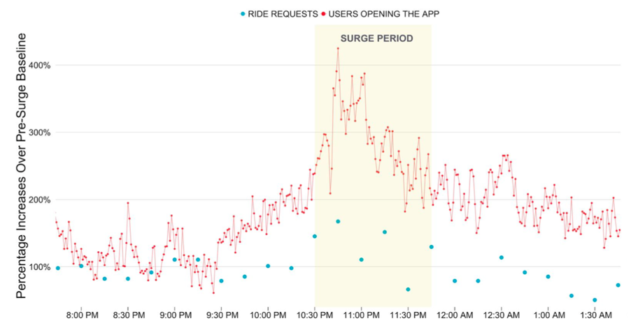
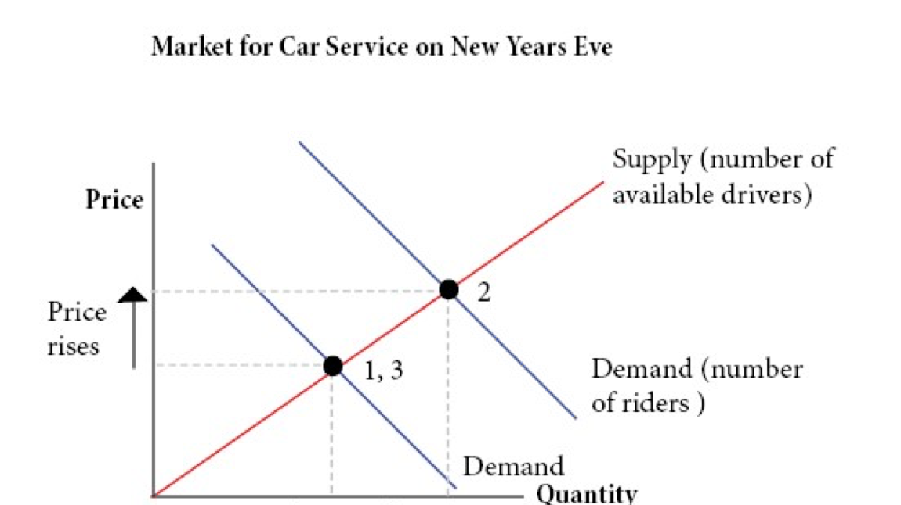

## Syllabus and Introduction

#### Intermediate Microeconomics (Econ 100A)

#### Natalia Lazzati

#### UCSC - Winter 2019

-----

## About me

* Assistant Professor – Economics UCSC

* My field of work: Micro Theory, Industry Org, Econometrics, & Exp. Econ
 
* PhD in Economics from the University of Arizona

* Prev. experience: 

* Taught Microeconomics before

-----

## Why take this class?

* Well, it is a requirement!

* ...more important: this course gives you tools to *understand better* how _consumers_ and _firms_ make decisions, and how prices are determined

* Examples: 
    - Policy Analysis	
    - Marketing
    - Life decisions

----- 

## Why take this class? (2) 

* This course provides **tools** that economists use to assess the benefits and costs of possible courses of actions

* This course will sharpen your **reasoning** to determine if a **certain action is "optimal"** (best)

* Examples:

    - Do we increase the **minimum wage**? If so, by how much?

    - What is the optimal **price for a product**. Are we leaving money on the table?!

    - Is a company inefficiently **allocating its resources**, so that its costs are higher than they could be. 

-----

## Syllabus

-----

## Syllabus (1) Natalia

* Email <nlazzati@ucsc.edu> 

* Office hours: MW 3-4PM and by appointment
   
* Engineering 2 Building - Office 415

* Lectures: TuTh from 11:40am to 1:15pm @ Steven Acad 150

----- 

## Syllabus (2) TAs

* TBD <@ucsc.edu>; office hrs: ______ 

* TBD <@ucsc.edu>; office hrs: ______ 

* TBD <@ucsc.edu>; office hrs: ______

* TBD <@ucsc.edu>; office hrs: ______

* All TAs will hold office hours in *Engineering 2, Rm ____* (subject to change)

----- 

## Syllabus (3) Discussion Sections

| Class # | Sec | Day / Time | Location
| --- | --- | --- | ---
|  41535 | 01A | TBA | TBA
|  41536 | 01B | TBA | TBA
|  41537 | 01C | TBA | TBA
|  41538 | 01D | TBA | TBA

------------ 

## Syllabus (4) MSI

* There is a new system (TBA makes announcement)

----- 

## Syllabus (5) Course Objectives

* **Microeconomics** is a body of concepts for understanding the economic behavior of individuals, firms and markets. 

* Our main focus: understanding how **supply** and **demand** form and then operate together in a **market**.

* We will highlight the different ways in which markets function; from perfectly competitive markets to monopolistic ones.

* We will also study strategic interaction and market failures.

----- 

## Syllabus (6) Prerequisites, Math

* Economics 1 and Calculus. 

* Mathematics is a vital tool for conducting economic analysis. 

* Main mathematical tools to be familiar with: 
    - graphing functions on a plane, 
    - solving a system of two (or three) equations and two unknown variables,  
    - derivatives (get the concept and be able to compute the derivative of common functions).
    - Basic optimization

----- 

## Syllabus (7) Textbook and Readings

* Text: “Intermediate Microeconomics: A Modern Approach (Ninth Edition)” by Hal R. Varian.
 
* The prior edition is acceptable as well.
 
* It is students’ responsibility to keep up with any important deviations from the current version. 

* Additional readings may be assigned during the quarter.

* If you want to read more than one book: Perloff's "Microeconomics"

----- 

## Syllabus (8) Exams and Grading [ to be changed ]
 
* Two midterms each worth 20% - April 24 and May 22

* **Comprehensive final exam** worth 40% on Monday, June 12 (12-2:30PM).

* Exams are closed book and notes may not be used. Unless otherwise indicated, only a pen and pencil are needed for the exams.

-----

## Syllabus (9) Homework Assignments [ to be changed ]

* 5 to 6 graded homework assignments worth 20% of the total grade

* **Late assignments will not be accepted**

* Good news: the lowest grade will be dropped. (if have an emergency that prevents you from turning in your homework - you will use this feature) 

* Team work is encouraged. However, everyone must hand in their own homework and show his/her work

-----

## Syllabus (10) Canvas ( Piazza - Lecture Slides)
 
* Course information and materials, including homework assignments and practice exams, will be posted on Canvas (canvas.ucsc.edu).

* It is each student’s responsibility to check Canvas for course updates and new material during the quarter.

* Questions about the material, homework and exams are only admissible via Piazza. You can access our Piazza page through Canvas.

* Piazza is exclusively to discuss the subject matter. Students who violate this rule will be excluded from Piazza.
 
* Lecture slides links will be distributed through Canvas.

-----

## Syllabus (11) Other Miscellanea

* You will have access to the "Intermediate Micro Video Handbook" (IMVH) developed by UCSD-Economics. Look for the “UCSD IMVH” link on the class site on e-commons. This is optional, but likely helpful.

* In some lectures, we will use MobLab (www.moblab.com) to illustrate some economic concepts using interactions in classroom experiments or games (free, and maybe with real prizes!). You will receive an invitation soon.

* Feedback and suggestions are very welcome!

* Please include “[ECON 100A]” in the subject of every email you send to the instructor or TAs. For example: Subject: [ECON 100A] I have a question about HW2!

-----

## Syllabus (12) Misconduct and Accommodations

* Academic Misconduct / Dishonesty: A student who is responsible for academic misconduct or dishonesty (cheating during tests, plagiarism etc) is subject to both academic and disciplinary sanctions. As the academic sanction, the student will automatically earn a failing grade for the course. Disciplinary sanctions are determined by the student’s College Provost or the Academic Tribunal. I encourage you to review the (new) Academic Misconduct Policy for Undergraduates: http://www.ue.ucsc.edu/academic_misconduct 

* Special Accommodations due to Disability: Any student who thinks s/he is in need of accommodation based on the impact of a disability should contact me privately to submit their Accommodation Authorization and discuss specific needs. Please do this preferably within the first two weeks of the quarter. Please contact the Disability Resource Center at 831-459-2089 in room 125 Hahn Student Services or by e-mail at drc@ucsc.edu to coordinate those accommodations. 

-----

## Syllabus (13) 

* Final Class Rules: be on time, polite and respectful.

* Earn **honorary points**, participate! 

* Use all the resources available (e.g. Modified Supplemental Instructions, TAs, IMVH, EconGraphs, etc etc)

* If the class is too easy for you, do not settle, ask for more. I will point you to more advanced material so you can take it to the next level. :)

-----

## How to succeed in this course

* If you are under some exceptional situation, **talk to professor and TAs early**.

* Ask for advice on how to approach studying for this class.

* Students who did well in this class:

    * Study on average 7 hours a week on their own.

    * Study way more than 10 hours in exam week.

    * 70% read textbook, ~80% never miss lectures, ~80% never miss sections.

    * Be consistent, practice your math, always study both theory and exercises.

-----

## Introduction [ update this ]

-----

## What is Microeconomics

* Microeconomics is the study of how **individual economic decision-makers** such as consumers, workers, firms or managers **allocate scarce resources** among alternate uses. 

* This study involves both the _behavior_ of these economic agents on their own and the way their behavior _interacts_ and _aggregate_ to form larger entities, such as _markets_.

-----

## Two basic postulates:

* Rational Choice: Each person tries to choose the best alternative available to him or her.

* Equilibrium: Market price adjusts until quantity demanded equals quantity supplied. More generally: state or condition of a system that will continue as long as the acting forces in the remain in balance.

-----

## Example: UBER

<!---->

-----

## Example: UBER

<!---->

-----

## Example: UBER

<!---->

-----

## Example: UBER

<!---->

-----

## Thanks

<!--<iframe src="https://www.econgraphs.org/graphs/micro/consumer_theory/budget_constraint?embed=true" ></iframe>-->

<!--
========================================================================

cd docs && \
pandoc  \
-t revealjs -V revealjs-url=reveal.js \
--css=reveal.js/css/theme/simple.css \
-H reveal.js/js/revealMathJax.js \
-s S1_Introduction.md -o S1_Introduction.html && \
cd .. && \
git add docs/S1_Introduction.html && \
git commit -am " add content to S1_Introduction.md " && \
git push origin master && \
mkdocs gh-deploy

========================================================================
-->