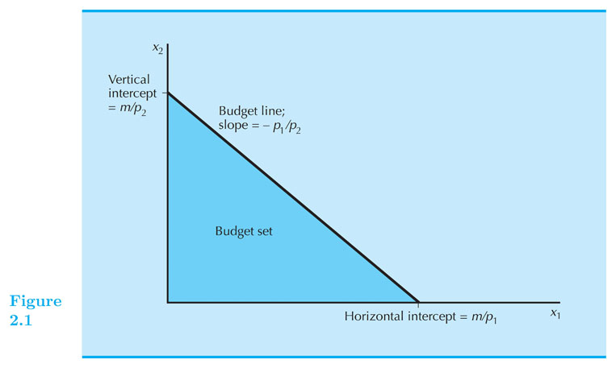

    
## Budget Constraint

### Intermediate Microeconomics (Econ 100A)

#### Kristian López Vargas

#### UCSC - Spring 2017

---------------------------------------

## Consumption Choice Sets

* A consumption choice set is the collection of all consumption choices available to the consumer.

*   What constrains consumption choice?

    - Budgetary, time and other resource limitations.

---------------------------------------

## Consumption bundle 

* A consumption bundle containing $ x_1 $ units of commodity 1, $ x_2 $ units of commodity 2 and so on up to $ x_n $ units of commodity n is denoted by the vector  $ ( x_1, x_2,  … , x_n ) $.

* Prices or goods are denoted by: $ p_1, p_2, … , p_n $.

---------------------------------------

## Affordable Bundles - Budget Constraints

* Suppose prices are $ p_1, p_2, … , p_n $ and a consumer has $ m $ as income. 

* Question: 
    - When is a consumption bundle $ (x_1, … , x_n) $ affordable at those given prices and income?

-----

## Affordable Bundles - Budget Constraints

* Answer: 

    - when $ p_1 x_1 + … + p_n x_n \\leq m $
          
    - where $ m $ is the consumer’s (disposable) income.

* That is, all the bundles that when purchased do not exhaust the consumer's income.  

-----

## "Budget line" or "budget constraint"

* The bundles that are only **just affordable** form the consumer’s **budget constraint** or budget line.

* This is the set:

$ \\{ ( x_1 ,…, x_n ) \quad:\quad p_1 x_1 + … + p_n x_n = m \\} $

* For simplicity we will only work with $ x_1, … , x_n $ are all equal or greater than zero.

-----

## Budget Set

* The consumer’s **budget set** is the set of all affordable bundles;

$ B(p_1, … , p_n, m) =
\\{ (x_1, … , x_n) \quad:\quad p_1 x_1 + … + p_n x_n \\leq m \\} $

* The budget constraint (or budget line) is the upper boundary of the budget set.

------

## Budget for Two Commodities

* $ p_1 x_1 + p_2 x_2 = m $. Affordable set, intercepts, slope.

<!---->

------

## Budget for Three Commodities

<!---->

------

## Finding the slope of the BC

* Budget line: $ p_1 x_1 + p_2 x_2 = m $

* Solve for $ x_2 $ :

     * $ p_2 x_2 = m - p_1 x_1 $

     * $ x_2 = \\frac{m}{p_2}  - \\frac{p_1}{p_2} x_1 $
 
* Therefore the slope is: $ - \\frac{p_1}{p_2} $

* What is the interpretation: **relative price**.

------

## Example of BC

* Good one is beer (good 1) and orange juice (good 2).

* Suppose $ p_1 = 3 $ and $ p_2 = 1 $.
  
* Income = 100

* slope = - 3: _Consumer need to give up (buy less) 3 oz. of orange juice to afford (be able to buy) 1 additional oz of beer._

* You can use the market to transform three units of OJ into one unit of beer, at the current prices. Therefore the term of **relative price**
 
-----

## Changes in the BC

* The budget constraint and budget set depend upon prices and income. What happens as prices or income change?

* Income change?

* Prices change?

* Board - Doc Camera

* Makler's [EconGraphs](https://www.econgraphs.org/graphs/micro/consumer_theory/budget_constraint?textbook=varian)

-----

## Introducing EconGraphs

<iframe 

src="https://www.econgraphs.org/graphs/micro/consumer_theory/budget_constraint?embed=true&textbook=varian" 

style="border:0px #FFFFFF none;" name="myiFrame" scrolling="auto" frameborder="0" marginheight="0px" marginwidth="0px" height="600px" width="850px"

></iframe>

_____

## Income Changes

<!---->

* What bundles become unaffordable or newly affordable?

-----

## Income Increases

* Increases in income m shift the  constraint outward in a parallel manner, thereby enlarging the budget set and improving choice.

* Decreases in income m shift the  constraint inward in a parallel manner, thereby shrinking the budget set and reducing choice.

* Which one is "good" for consumer?

-----

## Price Changes

<!---->

* What bundles become unaffordable or newly affordable?

-----

## $ p_1 $ increases 

* $ p_1 $ increases from $ p_1 $ to $ p_1' $

* Budget constraint pivots: slope get steeper from $ -p_1 / p_2 $ to $ -p_1'/p_2 $

* Increasing the price of one commodity pivots the constraint inward.  

* Some old choices are lost, so increasing one price could make the consumer worse off.

-----

## Ad Valorem Sales Taxes

* An ad valorem sales tax levied at a rate of 5% increases all prices by 5%, from $ p $ to $ 1.05 p $ .

* An ad valorem sales tax levied at a rate of t increases all prices by tp from p to (1+t)p.

* BC under a uniform sales tax: $ (1+t) p_1 x_1 + (1+t) p_2 x_2 = m $

* Do the graph! 

-----

## Exercise: In kind gifts

* Consumer receives $ g_1 $ units of good one as a gift.

* Case 1: you can sell (trade) the gift if you want to.

* Case 2: you cannot sell the gift.

* Draw the budget line.

-----

## Exercise: The Food Stamp Program

* Coupons that can be exchanged only for food. 

* How does a food stamp alter a family’s budget constraint?

* Suppose $ m = {$}400 $ , $ p_F = {$}1 $ and the price of “other goods” is $ p_G = {$}1 $.

* The budget constraint is then $ F + G = 400 $

* Draw the budget line.

-----

## The Food Stamp Program

<!---->

-----

## The Food Stamp Program

* What if food stamps can be traded on a black market for $0.50 each?

-----

## Other important cases

* What if both, prices and income, double?
 
* What if there are bulk discounts for units beyond a threshold?

* What if there are quantity penalties for units beyond a threshold?

----- 

<!--
// This piece of code below creates the reveal presentation and pushes to GitHub and then deploys to GitHub pages. Modify the commit message and paste into terminal.

cd docs && \
pandoc  \
-t revealjs -V revealjs-url=reveal.js \
--css=reveal.js/css/theme/simple.css \
-H reveal.js/js/revealMathJax.js \
-s S2_Budget_Constraint_Ch2.md -o S2_Budget_Constraint_Ch2.html && \
cd ..

cd docs && \
pandoc  \
-t revealjs -V revealjs-url=reveal.js \
--css=reveal.js/css/theme/simple.css \
-H reveal.js/js/revealMathJax.js \
-s S2_Budget_Constraint_Ch2.md -o S2_Budget_Constraint_Ch2.html && \
cd .. && \
git add docs/S2_Budget_Constraint_Ch2.html && \
git add docs/S2_Budget_Constraint_Ch2.md && \
git commit -am " add content to S2_Budget_Constraint_Ch2.md " && \
git push origin master && \
mkdocs gh-deploy 

-->

