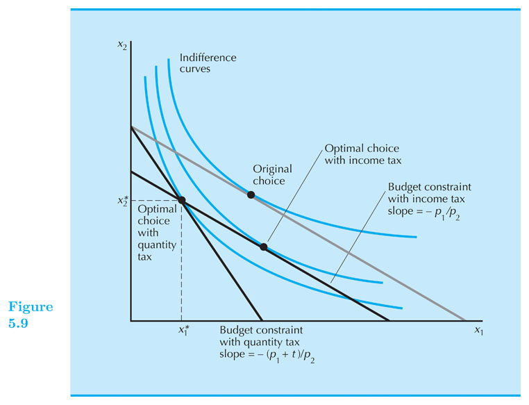

## Consumer Choice

#### Intermediate Microeconomics (Econ 100 A)

#### Natalia Lazzati

#### UCSC - Winter 2019

---------------------------------
## Consumer Choice
* This sectio presents some standard economic models of consumer behavior.

---------------------------------
## 2.1 Rational Choice
* The basic model of consumer choice studies the decision of a single person regarding what goods to acquire, and how much to buy of each of them, taking as given the prices of the goods and the income level of the consumer. Our simple model assumes that each consumer chooses the “best” combination of goods ---or bundle---  that “he can afford”. The idea of “best” builds on the notions of preferences and utility; our model captures “affordability” via budget sets. 

1. **Preferences**: The preferences on an individual consist of his personal ranking over all possible alternatives. We often capture these preferences by the so called utility function. 

2. ***Budget Set**: The budget set of an individual is the collection of all alternatives that he can afford given his resources (income or wealth) and the prices of the goods he faces in the market.

* Together, (1) and (2) induce choices. That is, they determine what consumption bundles are selected by the consumer. As prices and/or income change, so does the budget set and (often) the combination of goods that the consumer selects. The demand function describes the consumption decisions for all different combinations of prices and income levels. 

* To simplify the exposition, we will focus on a simple version of the consumer problem. The components of our model are as follows:

1. We assume there are only two goods: good 1 and good 2.
2. We represent the quantities of these goods as x1 and x2, respectively. The ordered pair x1,x2 denotes a bundle of goods.
3. The prices of the goods are represented by p₁ and p₂, respectively.
4. The income level of the consumer is denoted by *m*.

* Example: Suppose good 1 is orange juice and good 2 is salad. Then x1 indicates the quantity of orange juice (say in liters) and x2 is the quantity of salads (say in pounds). In this context, the combination (1/2, 1) represents the bundle of half liter of orange juice and one pound of salad. Suppose also that a liter of orange juice costs 5 dollars, a pound of salad costs 10 dollars, and the income level of the consumer is 500 dollars. In our notation, this information is concisely written as p1 = 5, p2 = 10, and m = 500.

* This simple two-goods model can be easily extended to more goods (e.g., it can be extended to the set of all goods you can get in the supermarket). We use the two-goods case because it helps us to illustrate the main concepts and tools in a simple way, often invoking a graphical representations of the model.

---------------------------------

## Consumer's Optimal Choice 

* Budget determines what I can buy.

* Utility function (preferences) determine how I value those affordable alternatives.

* Which bundle do I buy?

---------------------------------

## Consumer's Optimal Choice 

* The bundle with the highest utility among the affordable.

* We call this bundle the _Rational Constrained Choice_.

---------------------------------

## Three main cases of Optimal Choice.

1. Tangency Solution: When preferences are well behaved (smooth, convex, ...), then at the optimal bundle: $ MRS = \\frac{−p_1}{p_2} $ (for example Cobb-Douglass preferences)

2. Corner solutions or "boundary optimum": if $ MRS > \\frac{−p_1}{p_2} $ or $ MRS < \\frac{−p_1}{p_2} $ always (for example: perfect substitutes)

3. Kink optimality: if preferences are "kinky" (for example: perfect complements)

---------------------------------

## Optimal Choice - Tangency Solution

---------------------------------

## Optimal Choice - Tangency Solution (intuitively)

* Suppose your preferences look like Cobb-Douglass (smooth, convex).

* You have a BC and you are considering buying $ (x_1', x_2') $ such that $ x_1'>0, x_2'>0 $ on the BC.

* Suppose that only thing you know is that your MRS, at the bundle $ (x_1', x_2') $, is higher in magnitude than $ p_1 / p_2$. That is, the associated indifference curve is steeper than the budget constraint.
      
* Should you buy the bundle $ (x_1', x_2') $?

------

## Optimal Choice - Tangency Solution (intuitively)

* No.

* If MRS is steeper than BC, it means that at that point you value $ x_1 $ more than the market. So...  

* Buy more of that good 1.

* But how much more?

* Up to a point in which you and the market value $ x_1 $ the same (relative to $ x_2 $)

* First optimality condition:  $ MRS = \\frac{−p_1}{p_2} $

------

## Optimal Choice - Tangency Solution (math method 1)

Steps to find the optimal bundle (aka the demanded bundle) for tangency cases:

1. Identify clearly the utility function. 

2. Calculate the $ MRS $, it will be a function of $ x_1, x_2 $ and (possibly) on some parameters of the utility function.
 
3. Set the tangency condition: $ MRS = - \\frac{p_1}{p_2} $ call this Equation 1.

4. Identify the budget constrain and call it Equation 2. 

5. Equation 1 and Equation 2 form a 2-equation-2-unknowns system, so you can solve for the two unknowns: $ x_1 $ and $ x_2 $. 

------

## Optimal Choice - Tangency Solution (math method 1) - Example

Let's apply these steps to the case of Cobb-Douglas preferences: $ U(x_1, x_2) = x_1^{0.5}  x_2^{0.5} $
 
* Tangency : $ MRS = - \\frac{x_2}{x_1} $. Equate MRS to: $ - \\frac{p_1}{p_2} $ (Eq1)

* Budget constraint : $ p_1 x_1 + p_2 x_2 = m $   (Eq2)

* \[ solve for x1 and x2 in the system of two equations -- details in doc camera \]

* Optimal bundle: $ x_1^{\*} = \\frac{1}{2} \\frac{m}{p_1} $ and $ x_2^{\*} = \\frac{1}{2} \\frac{m}{p_2} $

------

## Optimal Choice - Tangency Solution - Cobb-Douglas Function

* Note if you have Cobb-Douglass utility, $ U = x_1^{a}  x_2^{b} $, you can always use method 1.

* Exercise: apply method 1 to this utility function: $ U = x_1^{a}  x_2^{b} $

* An alternative to method 1, is a more general method called the **Lagrange Method** that we will cover later.
 
------

## Cobb-Douglas - Typical Graph

<iframe 

src="https://www.desmos.com/calculator/pgnfwqtsut?embed" 

style="border:0px #FFFFFF none;" name="myiFrame" scrolling="auto" frameborder="0" marginheight="0px" marginwidth="0px" height="600px" width="700px"

></iframe>

------

## Case 2: Optimal bundle in corner solutions

The most typical case of this type of solution is with _perfect substitutes_ preferences.

Steps to finding the optimal bundle when x_1 and x_2 are _perfect substitutes_:

2. Calculate the $ MRS $, it will be a function of $ x_1, x_2 $ and (possibly) on some parameters of the utility function.
 
3. Compare its magnitude to the price ratio: $ \\frac{p_1}{p_2} $.

4. If $ |MRS| > \\frac{p_1}{p_2} $, then all income is spent on good 1: $ x_1 = m / p_1 $ and $ x_2 = 0 $   

5. If $ |MRS| < \\frac{p_1}{p_2} $, then all income is spent on good 2: $ x_2 = m / p_2 $ and $ x_1 = 0 $   

6. If $ |MRS| = \\frac{p_1}{p_2} $ any bundle that exhaust income will be optimal.

-----

## Finding the optimal bundle (perfect substitutes) - Example!

1. Say, $ u = 2 x_1 + x_2 $ 

2. $ MRS = - 2 / 1 = - 2 $ 
 
3. Compare |MRS| to price ratio: 2 vs. $ \\frac{p_1}{p_2} $.

4. If $ \\frac{p_1}{p_2} < 2 $, then: $ x_1 = m / p_1 $ and $ x_2 = 0 $   

5. If $ \\frac{p_1}{p_2} > 2 $, then: $ x_1 = 0 $ and $ x_2 = m / p_2 $

6. If $ \\frac{p_1}{p_2} = 2 $, any $ (x_1, x_2) $ such that $ p_1 x_1 + p_2 x_2 = m $ is optimal. 

------

## Perfect substitutes

* See graphs in document camera

* See graphs on EconGraphs

------

## Case 3: Optimal bundle in "kink" solutions

Most cases of "kink" solutions appear because of "perfect complement" preferences.

Steps to find the optimal bundle under "perfect complement" preferences:

1. Identify clearly the utility function: $ U = \\textrm{min} \\{ \\frac{x_1}{\\alpha}, \\frac{x_2}{\\beta} \\} $, for $ \\alpha, \\beta > 0 $

2. Calculate the **optimal consumption path**: $ \\frac{x_1}{\\alpha} = \\frac{x_2}{\\beta} $. Call this Equation 1.

4. Identify the budget constraint and call it Equation 2. 

5. Equation 1 and Equation 2 form a 2-equation-2-unknowns system, so you can solve for the two unknowns: $ x_1 $ and $ x_2 $. 

------

## Finding the optimal bundle - Perfect complements - Numerical Example

1. $ U = \\textrm{min} \\{ \\frac{x_1}{2}, x_2 \\} $.

2. **Optimal consumption path**: $ \\frac{x_1}{2} = x_2 $. This is Equation 1.

4. Budget Constraint $ m = p_1 x_1 + p_2 x_2 $

5. Optimal bundle: $ x_1^{\*} = \\frac{m}{p_1 + p_2/2} $ and $ x_2^{\*} = \\frac{m}{2 p_1 + p_2} $

------

## Perfect Complements

<iframe 

src="https://www.desmos.com/calculator/ybp2q0uamg?embed" 

style="border:0px #FFFFFF none;" name="myiFrame" scrolling="auto" frameborder="0" marginheight="0px" marginwidth="0px" height="600px" width="700px"

></iframe>

------

## Optimal choice with Lagrange's Method

* We are back to case 1 or "tangency solution".

* Conditions:

    * Utility function is differentiable and preferences are convex,

    * $ MRS(0,y) = infinity $ and $ MRS(x,0) = 0 $

* E.g. Cobb-Douglas satisfies these conditions.
  
* You can always use the Lagrange's method.
 
------

## Optimal choice with Lagrange's Method - Steps

1. Set Problem: $ \\textrm{maximize} \\quad U(x_1, x_2) $ subject to: $ m = p_1 x_1 + p_2 x_2 $

2. Write Lagrange's function
    * $ L = U(x_1, x_2) - \\lambda ( p_1 x_1 + p_2 x_2 - m) $

3. Differentiate with respect to $ x_1, x_2, \\lambda $, equate to zero.
    * $ \\frac{\\partial L}{\\partial x_1} = \\frac{\\partial U}{\\partial x_1} - \\lambda p_1 = 0 $ 
    * $ \\frac{\\partial L}{\\partial x_2} = \\frac{\\partial U}{\\partial x_2} - \\lambda p_2 = 0 $
    * $ \\frac{\\partial L}{\\partial \\lambda} = - p_1 x_1 - p_2 x_2 + m = 0 $

4. Solve system of three equations.

------

## Optimal choice with Lagrange's Method - Example

0. Consider: $ \\quad U(x_1, x_2) = x_1^{0.5} + x_2^{0.5} $ 
   
1. Problem: $ \\quad \\textrm{maximize} \\quad x_1^{0.5} + x_2^{0.5} $ subject to: $ m = p_1 x_1 + p_2 x_2 $

2. Lagrange's function: $ \\quad L = x_1^{0.5} + x_2^{0.5} - \\lambda ( p_1 x_1 + p_2 x_2 - m) $

3. Differentiate with respect to $ x_1, x_2, \\lambda $, equate to zero.
    * $ \\frac{\\partial L}{\\partial x_1} = 0.5 x_1^{-0.5} - \\lambda p_1 = 0 $ 
    * $ \\frac{\\partial L}{\\partial x_2} = 0.5 x_2^{-0.5} - \\lambda p_2 = 0 $
    * $ \\frac{\\partial L}{\\partial \\lambda} = - p_1 x_1 - p_2 x_2 + m = 0 $

4. Solution good 1: $ \\quad x_1^* = \\frac{ m }{ p_1 + p_2 } \\frac{ p_2 }{ p_1 } $

5. Solution good 2: $ \\quad x_2^* = \\frac{ m }{ p_1 + p_2 } \\frac{ p_1 }{ p_2 } $

-------

## Practice all these cases with the lagrange's Method.

1. $ U(x_1, x_2) = x_1^{1/2} x_2^{1/2} $

2. $ U(x_1, x_2) = x_1^{1/4} x_2^{3/4} $

3. => $ U(x_1, x_2) = x_1^{a} x_2^{b} $

4. $ U(x_1, x_2) = x_1^{a} x_2^{1-a} $

5. $ U(x_1, x_2) = (1/4) ln(x_1) + (3/4) ln(x_2) $
 
6. $ U(x_1, x_2) = a x_1 + b ln(x_2) $
 
------

## Tangency does not work with non-convex preferences 

* Be careful with tangency conditions. 

-------

## Corner solutions are not only for perfect substitutes 

-------

## All cases (with examples) EconGrahps

---------------------------------------

<iframe

src="https://www.econgraphs.org/graphs/micro/consumer_theory/utility_max?embed=true&textbook=varian"

style="border:0px #FFFFFF none;" name="myiFrame" scrolling="auto" frameborder="0" marginheight="0px" marginwidth="0px" height="600px" width="850px"

></iframe>

----------------------------------------

<!--
-------

## Quantity tax vs. Income tax

* Quant. tax (t dollars per unit)

    1. $ m = p_1 x_1 + p_2 x_2 $

    2. $ m = (p_1+t) x_1 + p_2 x_2 $

    3. Optimal bundle with Quant Tax: $ x_1^{\*} $ and $ x_2^{\*} $

    4. $ m = (p_1+t) x_1^{\*} + p_2 x_2^{\*} $

    5. $ TaxRev =  t  x_1^{\*} $

------

## Quantity tax vs. Income tax

* Income tax that collects the same revenue.

    1. $ m = p_1 x_1 + p_2 x_2 $

    2. $ m - TaxRev = (p_1+t) x_1 + p_2 x_2 $

    3. $ m - t x_1^{\*} = p_1 x_1 + p_2 x_2 $

    4. Notice: $ (x_1^{\*}, x_2^{\*}) $ is affordable under this income tax, but is not optimal choice. And, in fact, the new budget constraint passes through bundle $ (x_1^{\*}, x_2^{\*}) $ .

    4. Optimal bundle with Income Tax: $ x_1^{\*\*} $ and $ x_2^{\*\*} $

    4. $ m - t x_1^{\*} = p_1 x_1^{\*\*} + p_2 x_2^{\*\*} $

**Result: $ U(x_1^{\*\*} , x_2^{\*\*}) > U(x_1^{\*} ,  x_2^{\*}) $**

-------

## Quantity tax vs. Income tax

------
-->

<!--

-----

* The most preferred affordable bundle is called the consumer’s ORDINARY DEMAND at the given prices and budget.  

* Ordinary demands will be denoted by $ x_1\\ast(p_1,p_2,m) $ and $ x_2\\ast(p_1,p_2,m) $

------

##Rational Constrained Choice

* When $ x_1 \\ast > 0 $ and $ x_2\\ast > 0 $ the demanded bundle is INTERIOR.  

* If buying $ (x_1\\ast,x_2\\ast) $ costs \$m then the budget is exhausted

-----

##Rational Constrained Choice

* $ (x_1\\ast,x_2\\ast) $ satisfies two conditions:

* (a) the budget is exhausted;
>$ p_1x_1\\ast + p_2x_2\\ast = m $

* (b) the slope of the budget constraint, $ -p_1/p_2 $, and the slope of the indifference curve containing $ (x_1\\ast,x_2\\ast) $ are equal at $ (x_1\\ast,x_2\\ast) $.

----

##Computing Ordinary Demands

* How can this information be used to locate $ (x_1\\ast,x_2\\ast) $ for given $ p_1,p_2 $ and m?

----

##Computing Ordinary Demands - a Cobb-Douglas Example.

*Suppose that the consumer has Cobb-Douglas preferences.

*Then 

----

##Computing Ordinary Demands - a Cobb-Douglas Example.

* So the MRS is

* At $ (x_1\\ast,x_2\\ast) $, MRS = $ -p_1/p_2 $ so

 
(A)

----

##Computing Ordinary Demands - a Cobb-Douglas Example.

* $ (x_1\\ast,x_2\\ast) $ also exhausts the budget so

 
(B)

----

##Computing Ordinary Demands - a Cobb-Douglas Example.

* So now we know that

 (A)

 (B)

----
##Computing Ordinary Demands - a Cobb-Douglas Example.

* So now we know that

 (A)
 (B)

This simplifies to ...
----

##Computing Ordinary Demands - a Cobb-Douglas Example.

Substituting for $ x_1\\ast $ in

then gives

----
##Computing Ordinary Demands - a Cobb-Douglas Example.

So we have discovered that the most preferred affordable bundle for a consumer with Cobb-Douglas preferences

is 

----

##Computing Ordinary Demands - a Cobb-Douglas Example.

----

##Rational Constrained Choice

* When $ x_1\\ast > 0 $ and $ x_2\\ast > 0 $  
and $ (x_1\\ast,x_2\\ast) $ exhausts the budget,  
and indifference curves have no ‘kinks’, the ordinary demands are obtained by solving:
* (a) $ p_1x_1\\ast + p_2x_2\\ast = y $
* (b) the slopes of the budget constraint, $ -p_1/p_2 $, and of the indifference curve containing $ (x_1\\ast,x_2\\ast) $ are equal at $ (x_1\\ast,x_2\\ast) $.

----

##Rational Constrained Choice

* But what if $ x_1\\ast = 0 $?

* Or if $ x_2\\ast = 0 $?

* If either $ x_1\\ast = 0 $ or $ x_2\\ast = 0 $ then the ordinary demand $ (x_1\\ast,x_2\\ast) $ is at a corner solution to the problem of maximizing utility subject to a budget constraint.

----

##Examples of ‘Kinkny’ Solutions - the Perfect Complements Case 

(a) $ p_1x_1\\ast + p_2x_2\\ast = m $; (b) $ x_2\\ast=ax_1\\ast $.

Substitution from (b) for $ x_2\\ast $ in  
(a) gives $ p_1x_1\\ast + p_2ax_1\\ast = m $  
which gives 

A bundle of 1 commodity 1 unit and a commodity 2 units costs $ p_1 + ap_2 $;   
$ m/(p_1 + ap_2) $ such bundles are affordable.

----

-->

<!--

// This piece of code below creates the reveal presentation and pushes to GitHub and then deploys to GitHub pages. Modify the commit message and paste it into terminal.

cd docs && \
pandoc  \
-t revealjs -V revealjs-url=reveal.js \
--css=reveal.js/css/theme/simple.css \
-H reveal.js/js/revealMathJax.js \
-s S5_Choice_Ch5.md -o S5_Choice_Ch5.html && \
cd .. && \
git add docs/S5_Choice_Ch5.html && \
git commit -am " add content to S5_Choice_Ch5.md " && \
git push origin master && \
mkdocs gh-deploy 

-->

