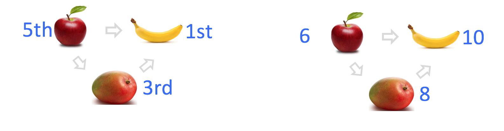

    

## Preferences

### Intermediate Microeconomics (Econ 100A)

### Kristian López Vargas

### UCSC - Spring 2017

---------------------------------------

## Rationality in Economics - Behavioral Postulates

* A decision maker knows what he/she likes/enjoys and chooses his/her most preferred alternative among the available ones.

* To say something about his/her behavior, we must model decision makers’ preferences.

---------------------------------------

## Basics of Preferences Relations

John: apple better than Mango, apple better than banana, mango better than banana.  
 

---------------------------------------

## Basics of Preferences Relations

Alí, Bob, Carlos, ... , John, ... ,Wei  
 

...

---------------------------------------

## Basics of Preferences Relations

* _Preferences_ are a personal ranking of alternatives.

* _Preferences_ are a personal assignment of _satisfaction level_ (**utility**).
 

---------------------------------------

## Preferences Relations

---------------------------------------

## Preference Relations

Comparing two different consumption bundles, $ x $ and $ y $ in the _consumption space_: 

* Strict preference "$ x \\succ y $" : _x is strictly more preferred than is y_

* Weak preference "$ x \\succsim y $" : _x is as at least as preferred as is y_ 
    
* Indifference "$ x \\sim y $" : _x is equally preferred as is y_
  
---------------------------------------

## Preference Relations

* Strict preference ( $ \\succ $ ) , weak preference ( $ \\succsim $ ) and indifference ( $ \\sim $ ) are all _preference relations_.
    * Binary and ordinal

* These relations suggest "feelings" and predict the behavior we would observe:
    * $ iPhone7 \\succ SGalaxy8 \\rightarrow $ _____________? 
    * $ iPhone7 \\succsim SGalaxy8 \\rightarrow $ _____________?
    * $ iPhone7 \\sim SGalaxy8 \\rightarrow $ _____________?
  
---------------------------------------

## Preference Relations

* They are interlinked
    * $ x \\succsim y $ and $ y \\succsim x $ implies $ x \\sim y $
    * $ x \\succsim y $ and NOT $ y \\succsim x $ implies $ x \\succ y $
    
---------------------------------------

## Assumptions on Preference Relations (1): Completeness

* **Completeness**: For any two bundles x and y it is always possible to make the statement that either 

* $ x \\succsim y $ or $ y \\succsim x $

<!-- --------------------------------------- -->

<!-- ## Assumptions on Preference Relations (2): Reflexivity -->

<!-- * **Reflexivity**: Any bundle x is always at least as preferred as itself; i.e. -->

<!-- * $ x \\succsim x $ -->

---------------------------------------

## Assumptions on Preference Relations (2): Transitivity

* **Transitivity**:  
    * If x is at least as preferred as y, and
    * y is at least as preferred as z, then:
    * x is at least as preferred as z.

* That is, if $ x \\succsim y $ and $ y \\succsim z $ implies $ x \\succsim z $

---------------------------------------

## Preferences in the Commodity Space 

* Recap: the **Commodity Space** is the positive quadrant of the n-dimensional plane ($ \\Re_{+}^n $) where these baskets or bundles live.

   

---------------------------------------

## Indifference Curves or Indifference Sets

* **Indifference Curves or Indifference Sets (of consumer _i_):**

* A set of bundles that a consumer regard equally.
 
* Take bundle $ x $. The set of all bundles equally preferred to $ x $ makes the "indifference curve" containing $ x $. We denote this set by $ I(x) $.

* All the bundles $ y $ in this set have this property: $ y \\sim x $.

* Since an indifference “curve” is not necessarily a "curve", we might want to call it _indifference “set”_.

---------------------------------------

## Indifference Curve (example)

<iframe
src="https://www.desmos.com/calculator/uy2bfa27vk?embed"
width="500px" height="500px" style="border: 1px solid #ccc"
frameborder=0></iframe>

* E.g.: $ (3, 4) \\sim (1, 12) $

---------------------------------------

## Weakly preferred set _WP(x)_

* WP(3,4) is the shaded area

<iframe src="https://www.desmos.com/calculator/1oe9fxpin2?embed" width="500px" height="500px" style="border: 1px solid #ccc" frameborder=0></iframe>

---------------------------------------

## Assumption on Preferences (3): More is better (monotoniticy)
 
**More is Better / Monotonicity:**
* All else the same, more of a “good” commodity is better than less. 
    * $ (5.01, 20) \\succ (5, 20) $
 
<iframe src="https://www.desmos.com/calculator/imvcct7ach?embed" width="500px" height="500px" style="border: 1px solid #ccc" frameborder=0></iframe>

---------------------------------------

## Assumption on Preferences (3): More is better (monotoniticy)

* This assumption implies that indifference sets are:
    * Curves! (not thick bands)
    * Downward sloped! (think about it)
    

 
---------------------------------------

## Is there only one indifference curve?

* No! Typically, there are infinite.

* In most cases it makes sense we talk and draw several ("the _indifference map_").

<iframe src="https://www.desmos.com/calculator/2zmovqixlt?embed" width="500px" height="500px" style="border: 1px solid #ccc" frameborder=0></iframe>

---------------------------------------

## Goods Vs. Bads Vs. Neutrals

Assume $ x_2 $ is a good: more is better.

Draw and IC for each case:

* $ x_1 $ is a good.

* $ x_1 $ is a bad.

* $ x_1 $ is a neutral.

---------------------------------------

## Home exercise:

* Can two distinct _indifference curves_ cross each other?

---------------------------------------

## Assumption on Preferences (4): Convexity
      
**(Weak) Convexity:** 

* Mixtures of bundles are (weakly) preferred to the bundles themselves.  

* Example: If the 50-50 mixture of the bundles $ x $ and $ y $ is formed like this $ z = (0.5) x + (0.5)y $.
Then $ z $ is at least as preferred as $ x $ OR $ y $.
      
---------------------------------------

## Assumption on Preferences (5): Convexity 

---------------------------------------

## Assumption on Preferences (5): Convexity 

* Example of preferences that do not satisfy **convexity** 

---------------------------------------

## Types of Tastes: Perfect Substitutes
 
* If a consumer always regards units of commodities 1 and 2 as equivalent (or equivalent up to a fixed ratio), then these commodities are regarded as *perfect substitutes* for the consumer.

    * Example: if you like Coke and Pepsi exactly equally, the total amount of bottles is what matter for the consumer. Another example: Agave - Sugar

<iframe src="https://www.desmos.com/calculator/adrkjfewat?embed" width="500px" height="500px" style="border: 1px solid #ccc" frameborder=0></iframe>

---------------------------------------

## Types of Tastes: Perfect Complements
 
* If a consumer always consumes commodities 1 and 2 in fixed proportion (e.g. one-to-one), then the commodities are *perfect complements* to the consumer.

* Only the number of pairs in the fixed proportion matter to the consumer. Examples?
    
<iframe src="https://www.desmos.com/calculator/s7megolbnt?embed" width="500px" height="500px" style="border: 1px solid #ccc" frameborder=0></iframe>

---------------------------------------

## Slope of an Indifference Curve

* The slope of an indifference curve is its **marginal rate-of-substitution or MRS**.

* MRS is the rate at which the consumer is only just willing to exchange/substitute commodity 2 for a small amount of commodity 1.

* $ MRS = \\frac{d x_2} {d x_1} $ along one indifference curve.

<!-- * $ MRS = - \\frac{∂U/∂ x_1} {∂U/∂ x_2} $ -->

--------------------------------

---------------------------------

<iframe 

src="https://www.econgraphs.org/graphs/micro/consumer_theory/indifference_curves?embed=true&textbook=varian" 

style="border:0px #FFFFFF none;" name="myiFrame" scrolling="auto" frameborder="0" marginheight="0px" marginwidth="0px" height="600px" width="850px"

></iframe>

---------------------------------

## MRS

* Think about the MRS in Perfect Substitutes

* Think about the MRS in Perfect Complements

<!--

// This piece of code below creates the reveal presentation and pushes to GitHub and then deploys to GitHub pages. Modify the commit message and paste into terminal.

cd docs && \
pandoc  \
-t revealjs -V revealjs-url=reveal.js \
--css=reveal.js/css/theme/simple.css \
-H reveal.js/js/revealMathJax.js \
-s S3_Preferences_Ch3.md -o S3_Preferences_Ch3.html && \
cd .. && \
git add docs/S3_Preferences_Ch3.html && \
git commit -am " add content in S3_Preferences_Ch3 " && \
git push origin master && \
mkdocs gh-deploy 

-->

