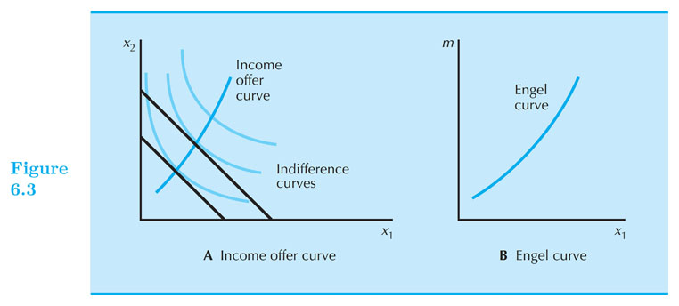
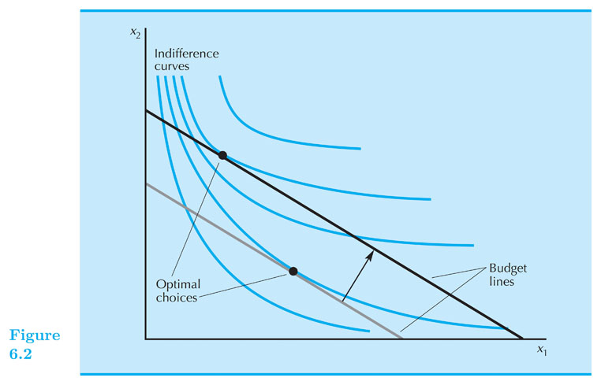
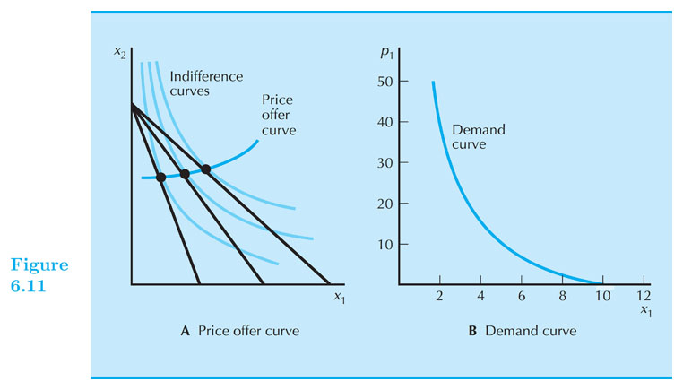
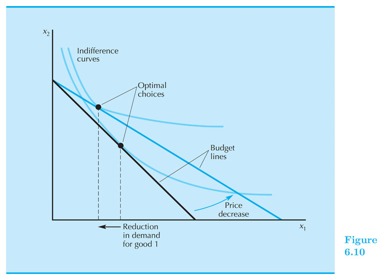

## Demand

#### Intermediate Microeconomics (Econ 100A)

#### Kristian López Vargas

#### UCSC - Spring 2017

---------------------------------------

## Demand function

* "Optimal bundle" for generic prices and income = Demand Function.

* The "optimal bundle" changes when income or prices change: that is why we call it _demand_ **function**.

---------------------------------------

## Demand function

* For a specific utility (preferences) and given set of income and prices, we have learned how to find the optimal bundle.
 
* If you solve this, so called, consumer's problem for generic income and prices $ (p_1,p_2,m) $, what you obtain is the _demand function_: $ x_1^{\*}(p_1,p_2,m) $.

* For example, if utility is Cobb-Douglas, then $ x_1^{\*} (p_1,p_2,m) = \\frac{a m}{ (a+b) p_1} $

**A consumer's demand function** indicates the optimal choice for a given set of prices and income. 
 
-----------

## Changes in income

$ x_1 = x_1(p_1,p_2,m) $

* How does the optimal consumption of $ x_1 $ changes with changes in income? $ \\frac{\\partial x_1}{ \\partial m } $ Vs. $ 0 $

* A **normal good**: its consumption increases when income increases. 
    * $ \\frac{\\partial x_1}{ \\partial m } > 0 $
    * Do graph

* An **inferior good**: its consumption decreases when income increases.
    * $ \\frac{\\partial x_1}{ \\partial m } < 0 $ 
    * Do graph

----------

## Engel Curve

* The Engel Curve maps each level of income to the optimal consumption of a good, holding prices constant. 

----------

## Engel Curve - Inferior good

----------

<iframe 

src="https://www.econgraphs.org/graphs/micro/consumer_theory/utility_demands_engel?embed=true&textbook=varian" 

style="border:0px #FFFFFF none;" name="myiFrame" scrolling="auto" frameborder="0" marginheight="0px" marginwidth="0px" height="600px" width="850px"

></iframe>

----------

## Changes in prices

* $ \\Delta p_1 $ tilts or pivots the budget line.

* How does the optimal consumption of $ x_1 $ changes with changes in $ p_1 $? $ \\frac{\\partial x_1}{ \\partial p_1 } $ Vs. $ 0 $

* Ordinary good: its consumption decreases when its price increases. 
    * $ \\frac{\\partial x_1}{\\partial p_1} < 0 $
    * Do graph

* Giffen good: its consumption increases when its price increases. 
    * $ \\frac{\\partial x_1}{\\partial p_1} > 0 $
    * Do graph

-----------

## Demand curve

* Demand curve: describes the relationship between the optimal choice of a good and its price, with income and other prices held constant.

-----------

## Giffen Good

----------

<iframe 

src="https://www.econgraphs.org/graphs/micro/consumer_theory/utility_demands_engel?embed=true&textbook=varian" 

style="border:0px #FFFFFF none;" name="myiFrame" scrolling="auto" frameborder="0" marginheight="0px" marginwidth="0px" height="600px" width="850px"

></iframe>

-----------

## Substitutes and Complements

* Gross Substitutes: $ \\frac{\\partial x_1}{ \\partial p_2 } > 0 $

* Gross Complements: $ \\frac{\\partial x_1}{ \\partial p_2 } < 0 $

<!------

A. Demand functions — relate prices and income to choices

B. How do choices change as economic environment changes?

1. **changes in income**
a) this is a parallel shift out of the budget line
b) increase in income increases demand — normal good. Figure 6.1.
c) increase in income decreases demand — inferior good. Figure 6.2.
d) as income changes, the optimal choice moves along the **income expan-
sion path**
e) the relationship between the optimal choice and income, with prices fixed, is called the **Engel curve**. Figure 6.3.

2. changes in **price**
a) this is a tilt or pivot of the budget line
b) decrease in price increases demand — **ordinary good**. Figure 6.9.
c) decrease in price decreases demand — **Giffen good**. Figure 6.10.
d) as price changes the optimal choice moves along the **offer curve**
e) the relationship between the optimal choice and a price, with income
and the other price fixed, is called the **demand curve**

https://www.econgraphs.org/graphs/micro/consumer_theory/utility_and_demand

https://www.econgraphs.org/graphs/micro/consumer_theory/utility_demands_engel

C. Examples
1. perfect substitutes. Figure 6.12.
2. perfect complements. Figure 6.13.
3. discrete good. Figure 6.14.
a) reservation price — price where consumer is just indifferent between consuming next unit of good and not consuming it
b) u(0,m) = u(1,m − r1)
c) special case: quasilinear preferences
d) v(0) + m = v(1) + m − r1
e) assume that v(0) = 0
f) then r1 = v(1)
g) similarly, r2 = v(2) − v(1)
h) reservation prices just measure marginal utilities
D. Substitutes and complements
1. increase in p2 increases demand for x1 — substitutes
2. increase in p2 decreases demand for x1 — complements
E. Inverse demand curve
1. usually think of demand curve as measuring quantity as a function of price
— but can also think of price as a function of quantity
2. this is the inverse demand curve
3. same relationship, just represented differently

-->

<!--

// This piece of code below creates the reveal presentation and pushes to GitHub and then deploys to GitHub pages. Modify the commit message and paste it into terminal.

cd docs && \
pandoc  \
-t revealjs -V revealjs-url=reveal.js \
--css=reveal.js/css/theme/simple.css \
-H reveal.js/js/revealMathJax.js \
-s S6_Demand_Ch6.md -o S6_Demand_Ch6.html && \
cd .. && \
git add docs/S6_Demand_Ch6.html && \
git commit -am " add content to S6_Demand_Ch6.md " && \
git push origin master && \
mkdocs gh-deploy 

-->