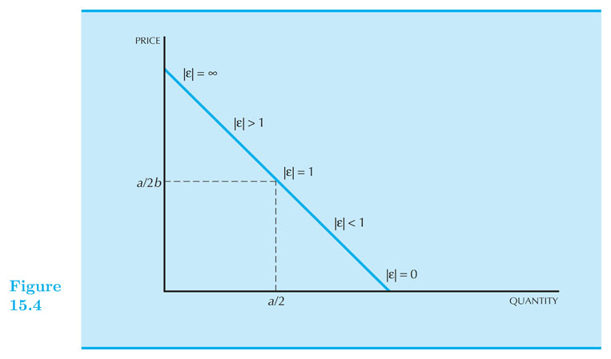

## Market Demand

#### Intermediate Microeconomics (Econ 100A)

#### Kristian López Vargas

#### UCSC - Spring 2017

-------

## Market demand

* Two goods, $ x_1 $ , $ x_2 $

* $ n $ consumers, indexed by $ i $

* Individual demands: $ x_{1,i}(p_1, p_2, m_i) $ and $ x_{2,i}(p_1, p_2, m_i) $

 

$ X_{1}(p_1, p_2, m_1, ..., m_n) = \\sum_{i=1}^{n} x_{1,i}(p_1, p_2, m_i) $

 

$ X_{2}(p_1, p_2, m_1, ..., m_n) = \\sum_{i=1}^{n} x_{2,i}(p_1, p_2, m_i) $

--------------

## Market demand - graphically

* Market demand is the horizontal addition of individual demands.

* Make sure you properly account for "zero demand" above highest "reservation price".

---------------

## Market demand - graphically

<iframe

src="https://www.desmos.com/calculator/mpvgxpebi0?embed"

style="border:0px #FFFFFF none;" name="myiFrame" scrolling="auto" frameborder="0" marginheight="0px" marginwidth="0px" height="600px" width="700px"

></iframe>

-------------

## Market demand - Example - Cobb Douglass

* $ u = x_1^a  x_2^b $

* $ 100 $ consumers, indexed by $ i $

* All individual have the same preferences, so same demand functions: $ x_{1,i}^* = \\frac{ a }{ (a+b) } \\frac{ m_i}{ p_1} $

$ \\begin{aligned}
X_1(p_1, p_2, m_1, ..., m_{100}) &= \\sum_{i=1}^{100} \\frac{ a }{ (a+b) } \\frac{ m_i }{ p_1 } \\\\
~ &= \\frac{ a }{ (a+b) } \\frac{ \\sum_{i=1}^{100} m_i }{ p_1 } \\\\
~ &= \\frac{ a }{ (a+b) } \\frac{ M }{ p_1 } \\\\
\\end{aligned} $

* What if there are different types of consumers?

-------------

## Market demand - Example - Linear Demands

* Suppose that the market consists of two individuals with demand functions given by:

$ x_{adam}(p, m_a) = max(20-p,0) $

$ x_{bob}(p, m_b) = max(30-3p,0) $

* The aggregate demand function is thereby given by:

$ Q^d(p,m_a,m_b) = x_a(p,m_a)+x_b(p,m_b) $

$ Q^d(p,m_a,m_b) =\\begin{cases}
50 - 4p & if\ ~ p < 10 \\\\
20 - p & if\ ~ 10 \\leq p \\leq 20 \\\\
0 & if\ ~ p > 20 \\\\
\\end{cases} $

----------------

## Reservation price 

* Some goods come in large discrete units

* Reservation price is price that just makes a person indifferent 

* $ u (0 , m) = u(1, m − p^{\*}_{a}) $

* Add up demand curves to get aggregate demand curve

-----------------

## Market demand - discrete goods

---------------

## Elasticity

Measures responsiveness of demand to price

$$ \epsilon = \frac{p}{x} \frac{dx}{dp} $$

* What does elasticity depend on? In general, how many and how close
substitutes a good has.

* What does it mean? Why is not just the derivative?

* We care about the magnitude so we often use: $ | \\epsilon | $ instead of $ \\epsilon $

--------------

## Elasticity  - Example for linear demand curve:

* We will use q instead of $ x_1 $ or $ x_2 $  

* Let demand curve be: $ q = a − bp $

* Price elasticity of demand: $ ε = −b \\frac{p}{q} = \\frac{−bp}{a−bp} $

--------

## Elasticity  - Example for linear demand curve:

--------------

## Elasticity  - Iso-elastic demand curve:
  
Let demand curve be: $ Q = A p^{-b} $

Lets calculate the elasticity:

$$
\begin{aligned}
\epsilon &= \frac{p}{Q} \frac{dQ}{dp} \\\\
         &= \frac{p}{ A p^{-b} } ~ A (-b  p^{-b-1} ) \\\\
         &= \frac{A}{A} (-b) \frac{p ~ p^{-b-1} }{ p^{-b} }  \\\\
         &= -b \\\\
\end{aligned}
$$

-----------

## Elasticity classification

* Elastic demand: absolute value of elasticity greater than $ 1 $

* Inelastic demand: absolute value of elasticity less than $ 1 $

-----------

## Revenue

<iframe src="https://www.desmos.com/calculator/gmsgtpcdoo?embed" width="600px" height="600px" style="border: 1px solid #ccc" frameborder=0></iframe>

-----------

## Revenue, price increase and elasticity

Demand curve:  $ Q^d = Q(p) $

Revenue: $ R = p \\times Q $

When does an increase in price turn into an increase in revenue?

That is, when $ \\frac{dR}{dp} > 0 $ ?

-----------

## Revenue, price increase and elasticity

$$
\begin{aligned}
\frac{dR}{dp} &= \frac{d(p  Q(p))}{dp}  \\\\
~   &= p \frac{dQ}{dp} + Q(p)  \\\\
~   &= Q \big( \frac{p ~ dQ}{Q ~ dp} + 1 \big) \\\\
~   &= Q ( \epsilon + 1 ) \\\\
\end{aligned}
$$

So as long as $ \\epsilon > -1  $,  we will have that $ \\frac{dR}{dp} > 0 $.

-----------

## Revenue, price increase and elasticity

You can use the same math, to see that if $ \\epsilon < -1  $,  then $ \\frac{dR}{dp} < 0 $.

Why does this matter? Consider the case of the linear demand where elasticity changes from 0 to -infinity as we increase price. Now we know that:

- At a price level where demand is price-**inelastic** (which happens at low prices), an **increase** in price will increase revenue. And,

- At a price level where demand is price-**elastic** (which happens at high prices), a **decrease** in price will increase revenue.

In conclusion, the price level that maximises revenue must be when the price-elasticity equals 1. The point we call unit-elasticity price level.

________

<!--
## Inverse Demand, elasticity and revenue

* Inverse demand: it is the demand curve except we solve for price $ p $: p(Q).

* Example: if demand is $ Q^d = 100 - 2p $ then, inverse demand is  $ P = 50 - 0.5Q $
  
* Marginal revenue $ = MR = \\frac{ dR }{ dQ } $ 

* $ MR = \\frac{ dR }{ dQ } = p + q \\frac{ dP }{ dQ } = p (1 - 1 / | \\epsilon |) $

-------

-->

<!--If you use calculus, make sure that you compute elasticities for the linear and log-linear cases.-->

<!--I love the Laffer curve example in the appendix. Here are some totally trivial elasticity calculations that give a major insight into a big policy issue. I really push on this example in class to show people how what they have learned can really help in making informed judgments about policy.-->

<!--

// This piece of code below creates the reveal presentation and pushes to GitHub and then deploys to GitHub pages. Modify the commit message and paste it into terminal.

cd docs && \
pandoc  \
-t revealjs -V revealjs-url=reveal.js \
--css=reveal.js/css/theme/simple.css \
-H reveal.js/js/revealMathJax.js \
-s S7_Market_Demand_Ch15.md -o S7_Market_Demand_Ch15.html && \
cd .. && \
git add docs/S7_Market_Demand_Ch15.html && \
git commit -m " add content to S7_Market_Demand_Ch15.md " && \
git push origin master && \
mkdocs gh-deploy 

-->