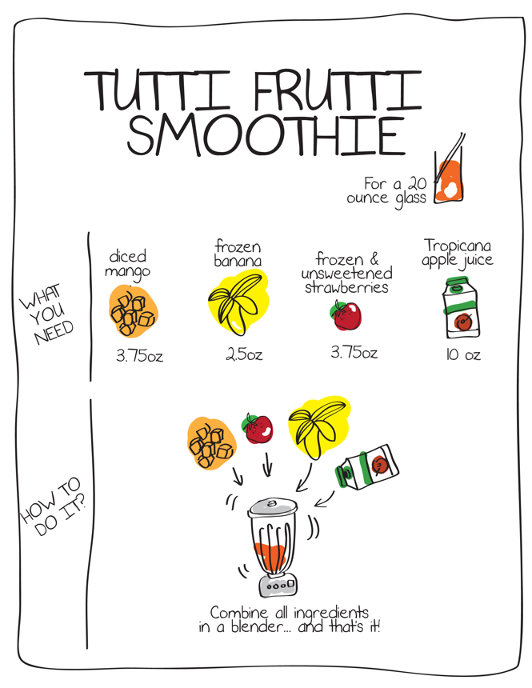
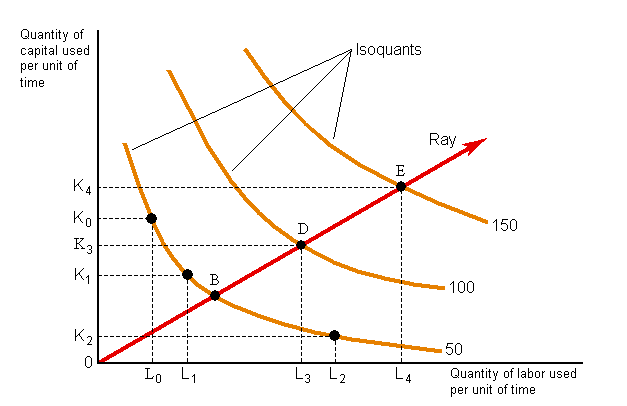
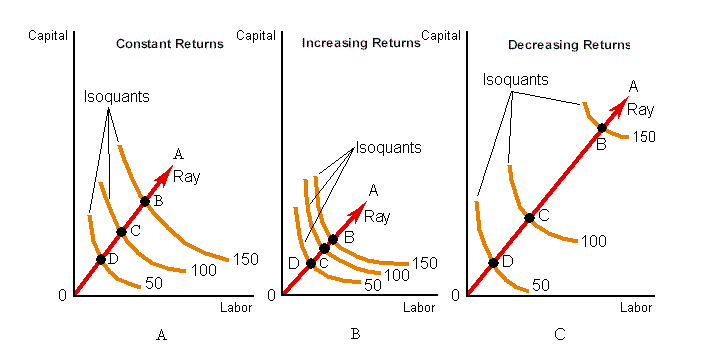

## Technology

#### Intermediate Microeconomics (Econ 100A)

#### Kristian López Vargas

#### UCSC - Spring 2017

-------

## Production

* Production transforms a set of inputs into a set of outputs

* Inputs / factors of production:
    * labor, land, raw materials, capital 
    * Measured in flows

* Output:
    * The amount of goods and services produces by the firm is the firm’s output.
    * In flow too

------

## Technology
 
* What is technology?

    * Knowledge
    * ...determines the quantity of output that is feasible to attain for a given set of inputs.
 
* What is a "technological constraint"?

    * Is what separates what is feasible given our current knowledge and what is not.

---------

## Technological constraints

1. **Production set**: all combinations of inputs and outputs that are technically feasible.

2. **Production function**: upper boundary of production set. 
    
    * The production function tells us the maximum possible output that can be attained by the firm for any given (combination) of inputs.

3. Examples (input, output):
    * (9 hrs of studying per week, final grade of 35) in PS but not efficient (below PF).
    * (9 hrs of studying per week, final grade of 94) not in PS (i.e. not feasible).
    * (9 hrs of studying per week, final grade of 93) in PS and on PF (feasible and efficient).

--------

## Production Functions, Sets

<iframe src="https://www.desmos.com/calculator/vlpsht9mav?embed" width="700px" height="500px" style="border: 1px solid #ccc" frameborder=0></iframe>

--------

## Example - smoothie recipe

--------

## Production Functions, Notation, Examples

* q = f(L, K)
    * q = output (note that book uses $ y $ for output)
    * K = Capital
    * L = Labor

* Examples:
    * $ q = f(L, K) = L + K $
    * $ q = f(L, K) = L \\times K^2 $
    * $ q = f(L) = L^{0.5} $ 
    * $ q = f(L, K) = min \\{ L , K/0.5 \\} $

* Remember: every input and output is expressed in units per unit of time.

--------

## Isoquants

* **Isoquants**: represent all the combinations of inputs that produce a constant level of
output.

* _Isoquants_ are like indifference curves for preferences, except "isoquants" describe technology not preferences.

* _Isoquants_ "live" in the space (plane) of factor of production or inputs.

-------

## Examples of isoquants

1. Fixed proportions, complements — one man, one shovel: $ q  = \\textrm{min} \\{ man, shovel\\} $

2. Perfect substitutes — pen, pencils: $ q  = pen + pencils $

3. Cobb Douglass: $ q = A L^a K^b $

4. Warning: a monotonic transformation of f(K,L) does not give the same technology!

* Exercise: what type of tech is a cooking recipe?

------

## Assumptions - well-behaved technologies

1. Monotonic — more inputs produce more output

2. Convexity — averages produce more than extremes

------

## 3-D version of a C-D production function 

------

## Marginal Product

* $ MP_L $ is how much extra output you get from increasing the usage of labor holding K constant.

* $ MP_L = \\frac{ ∂f(L,K) }{∂L} $

* Similarly: $ MP_K = \\frac{ ∂f(L,K) }{ ∂K } $

* Examples:
    * $ q = f(L, K) = L + K $
    * $ q = f(L, K) = L \\times K^2 $
    * $ q = f(L) = L^{0.5} $ 
    * $ q = f(L, K) = min \\{ L , K/2 \\} $
    
------

## Average product $ {AP}_L $ 

* $ AP_L $ is the per-worker output: $ AP_L = \\frac{ f(L,K) }{ L} $

* $ AP_K $ is the per machine output: $ AP_K = \\frac{ f(L,K) }{ K } $

* Examples:
    * $ q = f(L, K) = L + K $
    * $ q = f(L, K) = L \\times K^2 $
    * $ q = f(L) = L^{0.5} $ 
    * $ q = f(L, K) = min \\{ L , K/2 \\} $

------

## APL and MPL

* If $ MP_L > AP_L $ , can it be that $ AP_L $ is decreasing? Nope

* If $ MP_L < AP_L $ , can it be that $ AP_L $ is increasing? Nope

* If $ MP_L $ and $ AP_L $ cross, where/how do they cross?

------

## Technical rate of substitution TRS

* Similar to MRS

* Technical rate of substitution (TRS): Suppose you increase $ L $ by $ \\Delta L $. How much can you reduce K ( $ - \\Delta K $ ) such that production level is not altered?

* Mathematically, TSR is the derivative of K with respect to L, along one isoquant curve: $ TRS = \\frac{ dK }{ dL } = - \\frac{ MP_L }{ MP_K } $

* Examples: do Cobb-Douglas and linear production.

------

## Diminishing marginal product / returns

* **Diminishing marginal returns**: More of a _single_ input produces more output, but at a decreasing rate:
    * Example: $ q = f(L, K) = L^{0.5} K^2 $

* Diminishing TRS equivalent to convexity.

* (!) There is a difference between diminishing returns (MPs) and diminishing TRS (!)

    * Example: $ q = L \\times K $

    * $ MP_L $ is not diminishing but $ TRS $ is decreasing.

------

## Isoquants and Returns to Scale

---------------------------

## Returns to scale

* Is this scalable? 
    * Often, firms need to grow! Can I just multiply the amount of inputs?
    * That depends largely on the firms’ technology.

* What happen to my output if I double ALL my inputs?
    * Doubling inputs: $ f(2L, 2K) $ what is the resulting $ q $ ?
    * Similarly $ f(3L, 3K) $ ?
    * Similarly $ f(1.1L, 1.1K) $ ? 

------

## Returns to scale - definition

Production function exhibits:

* Constant returns to scale (CRS): when a percentage increase in inputs is followed by the same percentage increase in output.
    * Example: doubling inputs doubles output: $ f(2L, 2K) = 2f(L, K) $

* Increasing returns to scale (IRS): when a percentage increase in inputs is followed by a larger percentage increase in output. 
    * Example: $ f(2L, 2K) > 2f(L, K) $

* Decreasing returns to scale (DRS): when a percentage increase in inputs is followed by a smaller percentage increase in output.
    * Example: $ f(2L, 2K) < 2f(L, K) $

------

## Returns to scale - intuition

Some technologies allow for proportional scaling up of your production operation. Some other technologies do not. Why?

1. CRS: Easy replication (e.g. flyer distribution, data centers. Think of other examples) 

2. IRS: Occurs often with greater _specialization_ of L and K (e.g. a larger plant more productive than two small plants). 

3. DRS: Occurs often because of the difficulty in organizing/coordinating/_searching_ activities as firm size increases (e.g. mining). 

------

## Returns to scale - the math

For $ t>1 $, the production function $ f(L,K) $ exhibits CRS/IRS/DRS when:

1. CRS:  $ f(tL,tK) = t f(L,K) $ 

2. IRS:  $ f(tL,tK) > t f(L,K) $

3. DRS:  $ f(tL,tK) < t f(L,K) $

------

## Returns to scale - examples

* $ q = f(L, K) = L + K $
* $ q = f(L, K) = L \\times K^2 $
* $ q = f(L) = L^{0.5} $ 
* $ q = f(L, K) = min \\{ L , K/2 \\} $

-----

## Returns to scale - graphics

------

## Returns to scale - local notion

* "Returns to scale" are a **local notion!**

* Some prod functions have "global" returns to scale (e.g. $ q = L K $ ), but not all.

* Example: $ q = f(L,K) = (L+K) + (K+L)^2 - 0.1 (K+L)^3 $

    * Start at $ (L, K) = (0.5 , 0.5) $
    * Try scaling inputs up by $ t=2 $
    * Try scaling inputs up by $ t=10 $
    * [try set t=2 and then t=10 in this desmos example](https://www.desmos.com/calculator/gv4w07lsw6)
    
    
------

## Long run and short run of the firm

1. If all factors can be adjusted, **the firm is in the "long run"**

2. If at least one factor **cannot** be adjusted, **the firm is in the "short run"**

2. That is, we are in the short run (SR) when some factor(s) must stay fixed.

    * Typically, we hold $ K $ constant at level $ \\bar{K} $ in the SR.

    * So the typical production function in the short run is written as:

$$
q = f(L, \bar{K} )
$$

------

## Explore more graphics to understand better

[http://www2.hawaii.edu/~fuleky/anatomy/anatomy.html](http://www2.hawaii.edu/~fuleky/anatomy/anatomy.html)

-----

<!--

// This piece of code below creates the reveal presentation and pushes to GitHub and then deploys to GitHub pages. Modify the commit message and paste it into terminal.

cd docs && \
pandoc  \
-t revealjs -V revealjs-url=reveal.js \
--css=reveal.js/css/theme/simple.css \
-H reveal.js/js/revealMathJax.js \
-s S8_Technology_Ch19.md -o S8_Technology_Ch19.html && \
cd .. && \
git add docs/S8_Technology_Ch19.html && \
git commit -m " add content to S8_Technology_Ch19.md " && \
git push origin master && \
mkdocs gh-deploy
-->

