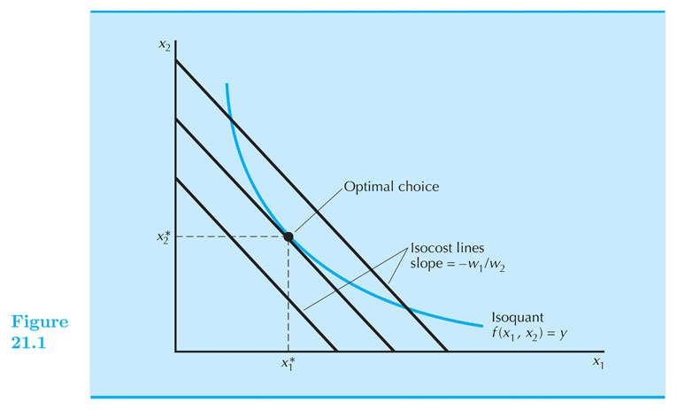

## Firm's Decisions - Cost Minimization

#### Intermediate Microeconomics (Econ 100A)

#### Kristian López Vargas

#### UCSC - Spring 2017

------

## Cost Minimization Problem - intro idea
 
* The firm operates in two kinds of markets:
    1. Inputs/factor markets (e.g. it buys labor and capital)
    2. Final product market

* Let's focus on optimal decisions regarding the first kind of market.
    
* We will assume for now the firms has a target prod level $ q_0 $. (i.e. an isoquant!)

* And, it aims to achieve that level of production in the best (most efficient) way possible.
  
* let the fun begin

------
    
## Cost Minimization Problem

* The only decision the firm controls at this point is how much of inputs it uses.  

* So the most efficient way in this context refers to what is the "right" combination of (L,K) so achieve $ q_0 $.  

* The right combination is the one that minimize the cost of producing the given target level of output $ q_0 $.

* Suppose wages are denoted by  $ w $ and rental price of capital is denoted by $ r $. 

* So the firm wants to: 

minimize: $ cost = w L + r K, \\quad $ subject to: $ f(L,K) = q_0 $.
 
------

## Isocost 

* Isocost: Combinations of input usage that cost the same (say $C):

* Example: This is isocost at a cost of $100:

    * $ w L + r K = 100 $

* Example: This is isocost at a cost of $50 when wages = 20 and price of capital = 10:

    * $ 20 L + 10 K = 50 $

* Draw draw draw more examples until you dream of isocosts a little.

------

## Solving the cost-minimization problem 

* Conceptually: find best(lowest) isocost given the required isoquant.
  
* Graphically... 

    1. Draw the "target" output level (isoquant) $ q_0 $.

    2. Ask: what is the cheapest combination of L,K that makes $ q_0 $ possible.

------

## Solving the cost-minimization problem

* What if prices of factors change?

* What if target output changes?

------

## Conditional factor demand functions

* Optimal choices of factors are called the **conditional factor demand functions**

    * That is: $ L^\* = L(w,r,q_0) $ and $ K^* = K(w,r,q_0) $

* Optimal cost is the **cost function**

    * That is: $ c(w,r,q_0) = w L(w,r,q_0) + r K(w,r,q_0) $

* Notice: all this is in the "long run" because we are able to adjust all inputs.

------

## Cost-minimization problem - The Math

$$
\underset{L,K}{\text{minimize:}} ~ w L + r K
\\
\text{Subject to:} ~  f(L,K) = q_0
$$

------

## Cost-minimization problem, Case 1: tangency.

* If technology satisfies mainly convexity and monotonicity then (in most cases) _tangency solution!_

* Tangency condition: slope of isoquant equals slope of isocost curve.   

    * In equation: $ - \\frac{w}{r} = - \\frac{MP_L}{MP_K} $ (EQ. 1)

* Constraint: $ q = f(L,K) $ (EQ. 2)

* System of two equations (Eq1 and Eq2), and two unknowns ($ L $ and $ K $).

------

## Example: Cobb-Douglass

If $ q = f(L,K) = L K $,

$$ L^{*}(w,r,q) =  \big( \frac{ q r }{ w } \big)^{1/2}  $$

$$ K^{*}(w,r,q) =  \big( \frac{ q w }{ r } \big)^{1/2}  $$

$$ c(w,r,q) = wL^\star + r K^\star = 2(  q r w  )^{1/2}  $$

Home exercise: solve the more general case:

* $ q = f(L,K) = A ~ L^{a} K^{b} $
* Find $ ~ c(w,r,q) = ?????? $

------

## Cost-minimization problem, Case 2: Corner Solution.

Mainly, but not exclusively:

1. Perfect Substitutes:

$$ q = f(L,K) = a L + b K $$

* For example: $ q = f(L,K) = L + K $

-------

## Example: Linear technology (1)

$$ q = f(L,K) = a L + b K $$

* Compare RTS  $ ( - \\frac{ a }{ b }) $  Vs. slope of the isocosts $ ( - \\frac{ w }{ r } ) $
 
* Alternatively, compare: $ \\frac{ a }{ w } $  Vs. $  \\frac{ b }{ r }  $

    1. If $ \\frac{ a }{ w } > \\frac{ b }{ r }  $ firm should use labor only.

    2. If $ \\frac{ a }{ w } < \\frac{ b }{ r }  $ firm should use capital only.

    3. If $ \\frac{ a }{ w } = \\frac{ b }{ r }  $ any point along the isoquant, minimizes cost.

------

## Example: Linear technology (2)

IF $ \\frac{ a }{ w } > \\frac{ b }{ r }  $
   
The firm should use only Labor (corner solution).

* Then: $ q = a L $ , so $ L^\*(w,r,q) =  \\frac{ q }{ a }  $

* Then: $ K^\*(w,r,q) =  0 $

* Then: $ c(w,r,q) = w L^\\star = \\frac{ w }{ a } q $

------

## Example: Linear technology (3)

IF $ \\frac{ a }{ w } < \\frac{ b }{ r }  $

The firm should use only Capital (corner solution).

* Then: $ q = b K $ , so $ K^\*(w,r,q) =  \\frac{ q }{ b }  $

* Then: $ L^\*(w,r,q) =  0 $

* Then: $ c(w,r,q) = r K^\\star = \\frac{ r }{ b } q $

* IF $ \\frac{ a }{ w } = \\frac{ b }{ r }  $, any point along the isoquant, minimizes cost.

------

## Example: Linear technology (4)

Putting all this together:

$$ c(w,r,q)= q \times
\begin{cases}
    \frac{ w }{ a },& \text{if} ~ \frac{ w }{ a } \leq  \frac{ r }{ b }    \\
    \frac{ r }{ b },& \text{if} ~ \frac{ r }{ b } <     \frac{ w }{ a }
\end{cases}
$$

This can be written as:

$$ c(w,r,q) = q ~ \textrm{min} \{ \frac{ w }{ a } , \frac{ r }{ b } \} $$

------

## Simpler example:

If $ q = f(L,K) = L + K $, then:

$$ c(w,r,q) = q \times \textrm{min} \{ w,r \} $$

-----

## Cost-minimization problem, Case 3: Kink Solution

2. Perfect Complements (kink solution):

$$ q = f(L,K) = \text{min} \{ \frac{L}{a} , \frac{K}{b} \} $$

2. if $ q = f(L,K) = \\textrm{min} \\{ L ,K \\} $, then:

$$ c(w,r,q) = (w + r)q $$

------

## Short-run conditional demand for labor, cost function 

* $ K = \\bar{K} $ 

* do the graph! 

* Short-run conditional demand of labor: $ L = L(w,r,q, \\bar{K}) $
 
* This demand is obtained from solving L from $ q = f( \\bar{K}, L) $
 
* If there are no other inputs it does not depend on prices of inputs. 

------

## Short-run - example 

* $ q = f(L, K) = K^{0.5} L^{0.5} $ 

* $ K = \\bar{K} $  

* $ L^{SR} = \\frac{ q^2 }{ \\bar{K} }  $

* $ c^{SR}(w,r,q, \\bar{K}) = w \\frac{ q^2 }{ \\bar{K} } + r \\bar{K} $

------

## Returns to scale and the cost function

* Let us define the average cost function:

* $ AC(w,r,q) = \\frac{ c(w,r,q) }{ q } $
 
* IRS implies that *AC* is decreasing in $ q $. (e.g. if we want to double q, we can less than double costs).
   
* CRS implies that *AC* is constant in $ q $. (e.g. if we want to double q, we need to double costs).

* DRS implies that *AC* is increasing in $ q $. (e.g. if we want to double q, we need to more than double costs).

------

## Types of costs: Fixed and quasi-fixed costs

1. Fixed: costs that must be paid, regardless of output level.

2. Quasi-fixed cost: costs that must be paid, only if output level > 0. (heating, lighting, etc.) 

3. Sunk cost: fixed costs that are not recoverable (painting your factory)

------

<!--

 
B. Revealed cost minimization

1. Suppose we hold output fixed and observe choices at different factor prices.

2. When prices are $ (w^s,r^s) $, choice is $ (L^s,K^s) $, and when prices are $ (w^t,r^t) $, choice is $ (L^t,K^t) $.

3. If choices minimize cost, then we must have

> $ w^t L^t + r^t K^t \leq w^t L^s + w^t K^s $
> $ w^s L^s + w^s K^s \leq w^s L^t + r^s K^t $

4. This is the #### ** Weak Axiom of Cost Minimization (WACM) **

5. What does it imply about firm behavior? 

6. Multiply the second equation by -1 and get

> $ w^t L^t + r^t K^t \leq w^t L^s + w^t K^s $

> $ -w^s L^t - w^s K^t \leq -w^s L^s - r^s K^s $

7. Add these two inequalities: 

> (w^t - w^s)(L^t - L^s) + (r^t - r^s)(L^t - L^s) \leq 0 

> \Delta w \Delta L + \Delta r \Delta K \leq 0

8. Roughly speaking, “factor demands move opposite to changes in factor prices”

9. In particular, *factor demand curves must slope downward.*

                
D. Long-run and short-run costs
1. long run: all inputs variable   
2. short run: some inputs fixed
                

-->

<!--

// This piece of code below creates the reveal presentation and pushes to GitHub and then deploys to GitHub pages. Modify the commit message and paste it into terminal.

cd docs && \
pandoc  \
-t revealjs -V revealjs-url=reveal.js \
--css=reveal.js/css/theme/simple.css \
-H reveal.js/js/revealMathJax.js \
-s S9_CostMinimization_Ch21.md -o S9_CostMinimization_Ch21.html && \
cd .. && \
git add docs/S9_CostMinimization_Ch21.html && \
git commit -m " add content to S9_CostMinimization_Ch21.md " && \
git push origin master && \
mkdocs gh-deploy

-->