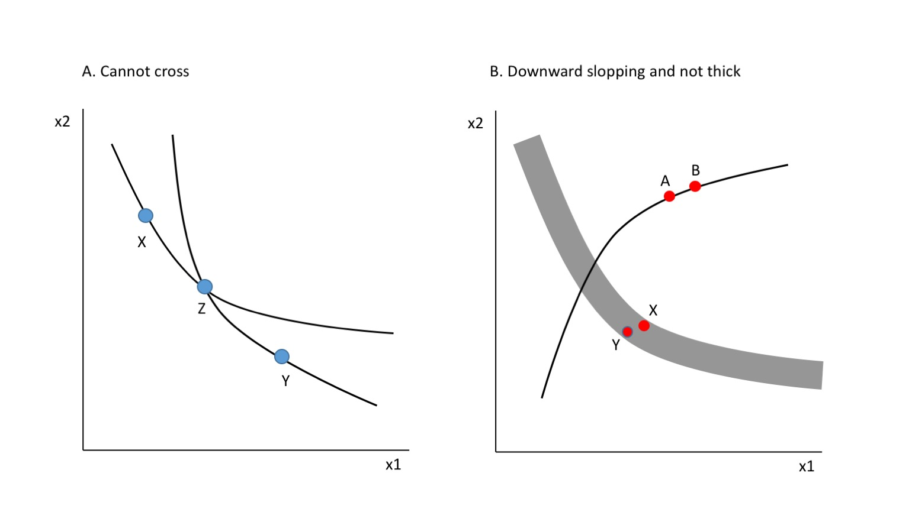
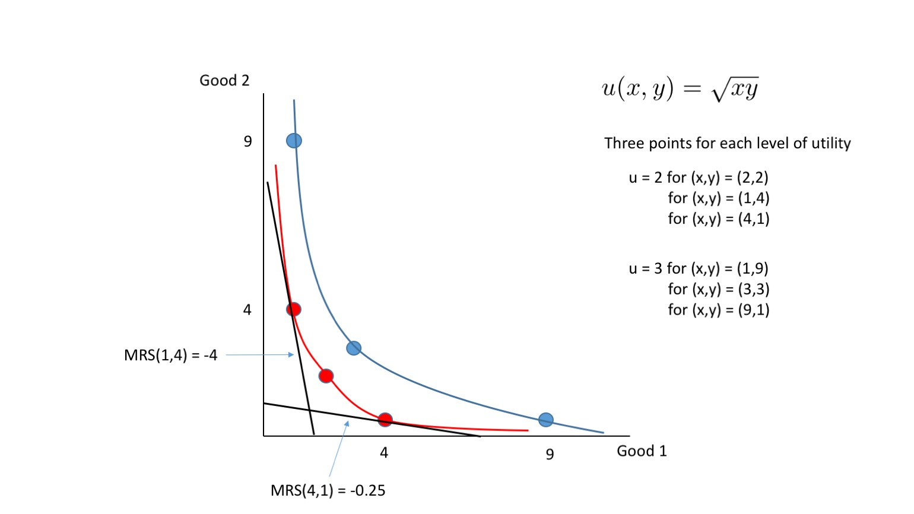

## Homework Assignment 1
Intermediate Microeconomics (Econ 100A)  
Kristian López Vargas  
UCSC - Spring 2017

** Due on Friday 14 Apr 2017 **

** Homework assignments will be turned-in on paper, at the beginning of the corresponding lecture. Late assignments will not be accepted. **

** Only four randomly-chosen questions will be graded. **

It is graded out of 100 points and 5 points will be subtracted if you do not staple your homework.

### Question 1:

You're waiting to board at an airport for a trip to Korea. You decided to buy cigarettes and Swiss chocolates for your friends at a shop in the airport. You have ${$}$30 only. A price for one pack of cigarettes is ${$}$2 and a price for one bar of Swiss chocolates is ${$}$3. You also learned from a traveller's book that you can only bring 10 packs of cigarettes into the country at the maximum and are not allowed to buy more than that $($"cigarettes rationing").

1. Write down the budget set and budget line in equations for the case without regulation on cigarettes amount.
2. Draw a budget line for each of two cases in a same graph: without the regulation on cigarettes amount and with the regulation in place. Put Swiss chocolates on the $y$ axis and cigarettes on the $x$ axis. Label $x$ and $y$ intercepts.
3. Suppose the price of a bar of Swiss chocolates increases to ${$}$4 due to an increase in cocoa powder. Draw a new budget line with the cigarettes rationing under the new price in the same graph.
4. Can you afford an bundle  $($cigarettes = 7 packs, chocolates =  5 bars$)$ under the old price of chocolates $($i.e. $p_2 = 3$ $)$? How about under the new price of chocolates $($i.e. $p_2 = 4$ $)$?  

###Solutions.

1. Budget set: $$Cigarettes \times p_1 + Chocolates \times p_2 \leq 30$$
Budget line:$$Cigarettes \times p_1 + Chocolates \times p_2 = 30$$

2. See the graph below.
3. See the graph below.
4. $7 \times 2 + 5 \times 3 = 14 + 15 = 29 < 30 \implies$ affordable
$7 \times 2 + 5 \times 4 = 14 + 20 = 34 > 30 \implies$ unaffordable

<!---->

### Question 2:

A consumer has an income of ${$}$1,000 to spend on food and medicine. The price of one unit of food is ${$}$5 and the price of one unit of medicine is ${$}$10. For each question, write down the mathematical expression of the budget constraint and **draw** it carefully.
 Put food on the x-axis and medicine on the y-axis. Label the incercepts, slopes, and kinks.

1. Suppose the consumer receives coupons for 50 units of food and those can only be used to buy food.

2. Suppose the consumer receives coupons for 50 units of food and can sell the coupons at half of the market price of the food.

3. Instead of the coupon, the consumer receives a 20% discount for additional units of food that exceed 100 units. That is, the consumer pays ${$}$5 for each of the first 100 units and ${$}$4 for each additional unit.

### Solutions.  
1. Suppose the consumer receives coupons for 50 units of food and those can only be used to buy food. $$\begin{align}
x_2 &= 100 &\text{ if } x_1 \leq 50 \\\\
x_2 &= - 0.5 x_1 + 125 \text{ or } 5 x_1 + 10 x_2 = 1250 &\text{ if } x_1 > 50
\end{align}$$

2. Suppose the consumer receives coupons for 50 units of food and can sell the coupons at half of the market price of the food. $$\begin{align}
x_2 &= -0.25 x_1 + 112.5  &\text{ or } &2.5 x_1 + 10 x_2 = 1125 &\text{ if } x_1 \leq 50 \\\\
x_2 &= - 0.5 x_1 + 125   &\text{ or } &5 x_1 + 10 x_2 = 1250 &\text{ if } x_1 > 50
\end{align}
$$ **Long explanation**: Suppose you consume $x_1$ units of good 1 such that $x_1 > 50$. What is your expenditure on good1? It is not ${$}5 \times x_1$ because you don't actually pay for the 50 units of those. Your expenditure on good 1 will be ${$}5 \times (x_1-50) $. For example, if you consume 60 units of $x_1$, your expenditure is $(60-50)\times 5 = 50 $. Your expenditure on good 2 is still $ 10 \times x_2 $. Combining it together, we have: $$\begin{align} 5(x_1-50) + 10x_2 &= 1000 \\\\
5x_1 - 250 + 10x_2 &= 1000 \\\\ 
5x_1 + 10x_2 &= 1250
\end{align}
$$ As you can see from the first line, your income is still 1,000. It is not that your income increased to 1,250. Consider the case when $x_1 \leq 50$. If you consume exactly 50 units of good1, then you use all 50 coupons. However, if you want to consume less than 50 units of good 1, you don't need all 50 coupons. In fact, you will want to sell it if you are allowed to $($e.g. you are not allowed to in Q2.1$)$. Hence, the price that matters is the price at which you can sell the coupons $(=2.5)$, not the price at which you are buying good 1. Since the budget line expresses expenditure as positive numbers, earnings must be expressed as negative numbers. For example, if you consume 49 units of good1, you earn ${$}$2.5, which can be expressed as $2.5(49-50) = -2.5$. In sum, your budget line is: $$\begin{align}
2.5(x_1-50) + 10x_2 &= 1000 \\\\
2.5x_1 - 125 + 10x_2 &= 1000 \\\\
2.5x_1 + 10x_2 &= 1125
\end{align} $$

3. Instead of the coupon, the consumer receives a 20% discount for additional units of food that exceed 100 units. That is, the consumer pays ${$}$5 for each of the first 100 units and ${$}$4 for each additional unit. $$
\begin{align}
x_2 &= -0.5 x_1 + 100 &\text{ or } &5 x_1 + 10 x_2 = 1000 &\text{ if } x_1 \leq 100 \\\\
x_2 &= - 0.4 x_1 + 90  &\text{ or } &4 x_1 + 10 x_2 = 900 &\text{ if } x_1 > 100
\end{align}
$$

<!---->

**Longer explanation:**

1. You know there are two prices depending on the amount of food you consume: 5 dollars if you consume 100 or less, and 4 dollars for units above 100 units of food.

2. That implies the budget line will have two segments with two different slopes: for $ x_1 \\leq 100 $ , $ \\frac{-p_1}{p_2} = \\frac{-5}{10} $ ; and for $ x_1 > 100 $ , $ \\frac{-p_1}{p_2} = \\frac{-4}{10} $.

3. Therefore it only remains for us to determine the intercepts of the budget constraint and the exact point at which slope changes. $ x_2 $ intercept is 100, because $ m/p_2 = 100 $, because that is all you can buy of x_2 with 1000 dollars. $ x_1 $ intercept is more interesting: the first 100 units cost 5 dollars times 100 units = 500 dollars, leaving 500 dollars of your income available. With those 500 dollars you can buy food units at four dollars. So you can buy additional 125 units of food. The most of food you can achieve therefore is 225 units (100+125). Also the exact point of change of slope is (100,50), because 50 that is the most you can buy of x_2 if you also buy exactly 100 units of x_1. That is all you need to draw the budget line. But if you want an equation for each segment you can proceed to the next point.

4. There are many (in fact, infinite) ways to express a segment of a line. Here I give you just one. For the first segment ($ x_1 \\leq 100 $), we know the intercept and the slope so that one is immediate: $ x_2 = intercept + slope ~ x_1 = 100 + (-5/10) x_1 $ (which can also be written as: $ 5 x_1 + 10 x_2 = 1000 $). For the second segment ($ x_1 > 100 $), we do not know the intercept but we can find it. We know that its slope is -(4/10) and that it passes through the point (100,50) so it must be that: $ 50 = intercept + (-4/10) ~ 100 $. So $ intercept = 90 $. So the line segment is $ x_2 = 90 + (-4/10) x_1 $ (which can also be written as: $ 4 x_1 + 10 x_2 = 900 $). Please understand that this does not mean that the income is 900 dollars; this is just an equation that represents the line segment we want.

### Question 3:

This question allows you to evaluate how to think about the welfare of consumers. Assume a consumer's welfare is driven by what he/she consumes.  

1. Suppose there are only two types of goods to consume: food and leisure. An average Californian citizen has a daily income of ${$}$100. The price of one meal of food is ${$}$20 and the price $($or value$)$ of one unit of leisure is ${$}$10. An average citizen in Mississippi has a daily income of ${$}$50. The price of one unit of food is ${$}$10 and the price $($or value$)$ of one unit of leisure is ${$}$10. Who is more well-off in terms of the bundles of goods they can consume? $($hint: draw budget sets.$)$

2. Suppose you earn ${$}$100 per day. One day your boss increases your income by 50% solely due to your high performance at work. Are you more well-off, worse-off, the same, or cannot answer compared to before the change?

3. Suppose the boss had lied to you. The reason why she increased your salary by 50% is because all other prices also increased by 50%. Are you more well-off, worse-off, the same, or cannot answer compared to before the change?

4. Suppose you are a big fan of Japanese food and Chinese food and those are the only two goods you consume. Suppose your income does not change and the price of Japanese food decreases. However, the price of Chinese food increases. Are you more well-off, worse-off, the same, or cannot answer compared to before the changes in prices?

###Solutions.

1. The budget line for a representative person living in Californian is $$
meal \times 20 + leisure \times 10 = 100\\\\
meal \times 1 +  leisure \times 0.5 = 5
$$
and the budget line for a	representative person living in Mississippi is $$
meal \times 10 + leisure \times 10 = 50\\\\
meal \times 1 +  leisure \times 1 = 5\\\\
$$
Since the budget set of a person in Mississippi is inside of the budget set of a person living in California, the person is California is more well-off than the person in Mississippi in terms of the amount of food and leisure that can be consumed.  
2. Well-off because you can afford more of every good. The budget set is wider.
3. The same because you can afford just as much as before. The budget set did not change.
4. We cannot answer without more information. It depends on which food you like more than the other which can be represented by an indifference curve.

### Question 4:

Answer the following questions regarding preferences:

4.1. Suppose you have two distinct bundles $ X $ and $ Y $, and, for you, $ X $ is strictly better than $ Y $. Explain briefly using a graph and words why the two indifference curves associated to two bundles $X$ and $Y$ (I(X) and I(Y)) cannot cross each other.   

4.2. Explain using a graph and words why if the assumption of monotonic preferences $($aka “more-is-better”$)$ implies that indifference curves are not thick and they must be downward sloped.

4.3. Provide three examples of goods that are typically regarded as perfect substitutes. Explain briefly.   

4.4. Provide three examples of goods that are typically regarded as perfect complements. Explain briefly.  

###Solutions.
1. From textbook, "To prove this, let us choose three bundles of goods, X, Y , and Z, such that X lies only on one indifference curve, Y lies only on the other indifference curve, and Z lies at the intersection of the indifference curves. By assumption the indifference curves represent distinct levels of preference, so one of the bundles, say X, is strictly preferred to the other bundle, Y . We know that X $\sim$ Z and Z $\sim$ Y , and the axiom of transitivity therefore implies that X $\sim$ Y . But this contradicts the assumption that X $\succ$ Y . This contradiction establishes the result—indifference curves representing distinct levels of preference cannot cross.''

2. **Thick indifference curve**: Suppose the monotonicity holds even with the thick indifference curve. In the graph, the bundle X has more of good 1 and good 2 than than bundle Y, but the thick indifference curve implies that the bundle X is equally preferred to Y. This contradicts with the monotonicity assumption. **Downward sloping**: Consider the indifference curve that is not downward sloping. By the definition of indifference curve, B is equally preferred to A. However, this again violates the monotonicity assumption because B has more of good 1 and more of good 2.   

<!---->

3. **Example1**: a consumer choosing between a blue pen and black pen who doesn't care about color.  **Example2**: a consumer choosing between a coke and a pepsi who cannot tell the difference.  **Example3**:  a consumer choosing between an organic milk with 1% fat produced by farm A and an organic milk with 1% fat produced by farm B.  
4. **Example1**: a consumer who drinks a cup of coffee only with 2 teaspoons sugar.   **Example2**: the number of left shoes and right shoes for a consumer who can only use pairs of shoes.    **Example3**: the number of nuts and bolts.

### Question 5:

For each of the following functions, i) pick three utility levels and draw the precise indifference curves that are associated with the levels of your choice, ii) label the utility level of the lines -- you cannot just draw random lines and assign arbitrary utility levels, and iii) give the name of preferences they represent (*hint*: see figures in textbook chapter 3).

1. $u(x_1,x_2) = x_1 + x_2$  
2. $u(x_1,x_2) = min(x_1, x_2)$  
3. $u(x_1,x_2) = x_1$  
4. $u(x_1,x_2) = x_1 - x_2$  
5. $u(x_1,x_2) = \sqrt{x_1 x_2}$  
6. $u(x_1,x_2) = -$\{$(x_1 - 3)^2 + (x_2 - 2)^2$\}  

### Solutions.
Choose level of U, e.g. 5, and then determine combinations of $(x_1, x_2)$ that can produce value given provided functions.

See the graphs below for precise level curves.

1: perfect substitutes preferences $($textbook Fig 3.3$)$

$
u(x_1,x_2) = x_1 + x_2 \\\\
\bar{u} = x_1 + x_2 \\\\
x_2 = \bar{u} - x_1 \\\\
\text{Pick levels of } \bar{u}: 4, 7, 10
$

<iframe src="https://www.desmos.com/calculator/djwzt7nbvi?embed" width="500px" height="500px" style="border: 1px solid #ccc" frameborder=0></iframe>
#

2: perfect complements preferences $($textbook Fig 3.4$)$

$
u(x_1,x_2) = min(x_1, x_2) \\\\
\bar{u} = min(x_1, x_2) \\\\
\text{Pick levels of } \bar{u}: 1, 2, 3
$

<iframe src="https://www.desmos.com/calculator/kowgubn2mt?embed" width="500px" height="500px" style="border: 1px solid #ccc" frameborder=0></iframe>
#

3: preferences with good 2 being neutral $($textbook Fig 3.6$)$

$
u(x_1,x_2) = x_1 \\\\
\bar{u} = x_1 \\\\
\text{Pick levels of } \bar{u}: 1, 2, 3
$

<iframe src="https://www.desmos.com/calculator/dpcvnys33a?embed" width="500px" height="500px" style="border: 1px solid #ccc" frameborder=0></iframe>
#

4: preferences with good 2 being bad $($textbook Fig 3.5$)$

$
u(x_1,x_2) = x_1 - x_2 \\\\
\bar{u} = x_1 - x_2 \\\\
x_2 = x_1 - \bar{u} \\\\
\text{Pick levels of } \bar{u}: -3, 0, 3
$

<iframe src="https://www.desmos.com/calculator/ihu28vwtc7?embed" width="500px" height="500px" style="border: 1px solid #ccc" frameborder=0></iframe>
#

5: Cobb-douglas preferences $($textbook Fig 4.5$)$  

$
u(x_1,x_2) = \sqrt{x_1 x_2} \\\\
\bar{u} = \sqrt{x_1 x_2} \\\\
\sqrt{x_2} = \\frac{\bar{u}}{\sqrt{x_1}} \\\\
x_2 = \\frac{\bar{u}^2}{x_1} \\\\
\text{Pick levels of }: \bar{u}: 1, 2, 3 \\\\
$  

<iframe src="https://www.desmos.com/calculator/8ugcddsdml?embed" width="500px" height="500px" style="border: 1px solid #ccc" frameborder=0></iframe>
#

6: preferences with $(3,2)$ as a satiation point $($textbook Fig 3.7$)$

$u(x_1,x_2) = - $ \{ $(x_1 - 3)^2 + (x_2 - 2)^2 $\}  
$\bar{u} = -  $\{$(x_1 - 3)^2 + (x_2 - 2)^2$ \}  
Pick levels of $\bar{u}: -1, -4, -9 $  
For example, $\bar{u} = -1 \implies 1^2 = $ \{ $(x_1 - 3)^2 + (x_2 - 2)^2$ \}

<iframe src="https://www.desmos.com/calculator/vvbkcoavls?embed" width="500px" height="500px" style="border: 1px solid #ccc" frameborder=0></iframe>

##

### Question 6:

Draw an indifference curve and its weakly preferred set for two goods that exhibit following preferences:  

1. monotonic and convex preferences  

2. monotonic and concave preferences  

3. non-monotonic preferences  

###Solutions:

6.1: Monotonic & Convex Preferences
<iframe src="https://www.desmos.com/calculator/wug6lq6ckj?embed" width="500px" height="500px" style="border: 1px solid #ccc" frameborder=0></iframe>

6.2: Monotonic & Concave Preferences
<iframe src="https://www.desmos.com/calculator/jtumr38hxb?embed" width="500px" height="500px" style="border: 1px solid #ccc" frameborder=0></iframe>

6.3: Non-monotonic and Convex
<iframe src="https://www.desmos.com/calculator/gtelkda1in?embed" width="500px" height="500px" style="border: 1px solid #ccc" frameborder=0></iframe>

### Question 7:

Consider a utility function $ u(x,y) = x^{a} y^{b} $, where $ 0 < a < 1 $ and $ 0 < b < 1 $. Also assume that $ x,y > 0 $.

7.1. Derive the marginal utility of $x$ and the marginal utility of $y$ and state whether or not the assumption that more is better is satisfied for both goods.  

7.2. Does the marginal utility of $x$ diminish, remain constant, or increase as the consumer buys more $x$? What does it mean in words?  

7.3. What is $MRS_{x,y}$?  

7.4. Suppose $a,b = \frac{1}{2}$. What is $MRS$ at $(x,y) = (1,4)$ and what does it mean in words? What is $MRS$ at $(x,y) = (4,1)$ and what does it mean in words?  

7.5. Continue assuming $a,b = \frac{1}{2}$. Draw two indifference curves of the utility function. To get full credit, draw one with the level of utility 2 and the other with the level of utility 3. For each indifference curve, label at least one point on the curve.    

7.6. Draw tangent lines at $ (x,y) = (1,4) $ and $ (x,y) = (4,1) $ in the same graph and label the slopes you solved in $ MRS(1,4) $ and $ MRS(4,1) $.

###Solutions.
1. $MU_x = ax^{a-1}y^b > 0$ and $MU_y = bx^{a}y^{b-1} > 0$. Since an increase in $x$,$y$ increases utility, ''more is better'' assumption is satisfied.
2. The derivative of $MU_x$ $($ or second derivative of $U(x_1,x_2)$ $)$:
$$
\frac{\partial MU_x}{\partial x} = a(a-1)x^{a-2}y^b < 0
$$
Since $0<a<1$, marginal utility of $x$ is decreasing. It means additional unit of good $x$ gives less and less utility as the consumer consumes more.  

3. $MRS(x,y) = \frac{d y}{d x} = - \frac{MU_x}{MU_y} = -\frac{ax^{a-1}y^b}{bx^{a}y^{b-1}} = -\frac{a}{b}\frac{y}{x}$
4. $MRS(1,4) = -4$ and $MRS(4,1) = -0.25$. The MRS measures the amount of good 2 that one is willing to give up for a marginal amount of extra consumption of good 1. When the consumer is consuming a bundle $(1,4)$, he is willing to pay four units of good 2 for a little more of good 1.  When the consumer is consuming a bundle $(4,1)$, he is willing to pay 0.25 units of good 2 for a little more of good 1. He is now willing to pay much less of good 2 because he now has more of good 1.  
5. See the graph below.  
6. See the graph below.  

<!---->

### Question 8:

8.1. Consider a transformation of the utility function in Question 7 using $ u' = ln (u) $. In other words, the new utility function $ u' = ln (u) = ln(x^{a}y^{b}) = a \times ln(x) + b \times ln(y) $. What is $MRS_{x,y}$ of this new utility function? Is it the same as or different from $MRS_{x,y}$ you found in Q7.3? Explain.   

8.2. Will the MRS be still the same for each of the following transformation? Explain without directly solving for MRS.   
a). $u' = u^2$  
b). $u' = 1/u^2$  
c). $u' = 1987 \times u - 507$  
d). $u' = e^u$   

8.3. Explain why taking a monotonic transformation of a utility function does not change the marginal rate of substitution (MRS).   

###Solutions.
1. $MRS(x,y) = -\frac{MU_x}{MU_y} = - \frac{\frac{a}{x}}{\frac{b}{y}} = -\frac{a}{b}\frac{y}{x}.$ This is equal to the MRS in Q7.3.   
2. MRS will be the same for a transformation that is strictly increasing. We know that linear transformation with a positive slope - c) and exponential function - d) are strictly increasing. For a) and b), the MRS will not be the same because they are not strictly increasing. For a), a counter example is that $2 > -3$, but $f(2) < f(-3)$, reversing the order. For b), a counter example is $2 > 1$, but $f(2) < f(1)$, reversing the order.
3. A monotonic transformation preserves the ranking of bundles, hence preferences. Since MRS is determined by preferences, it does not change.  

<!--
git add docs/hw1_solutions.md && \
git commit -am " add content to hw1_solutions.md " && \
git push origin master && \
mkdocs gh-deploy
-->